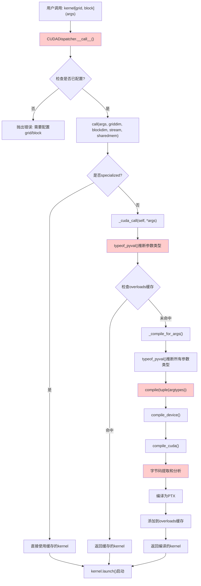
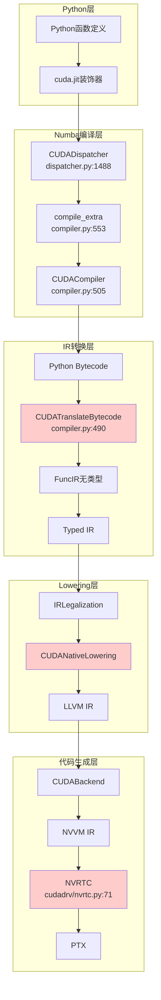
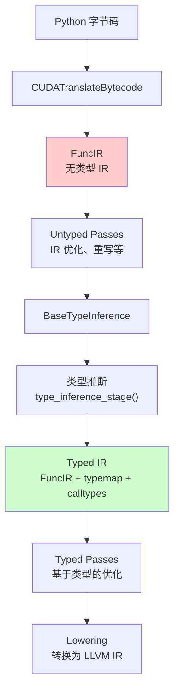
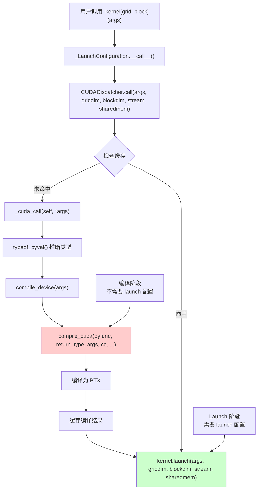
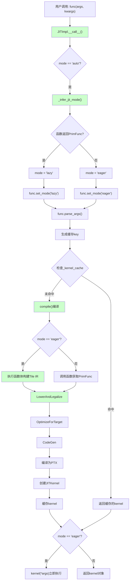
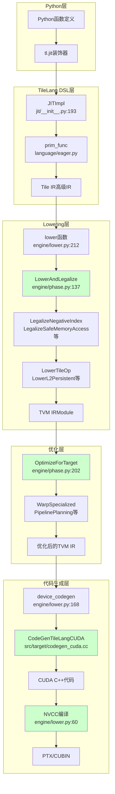
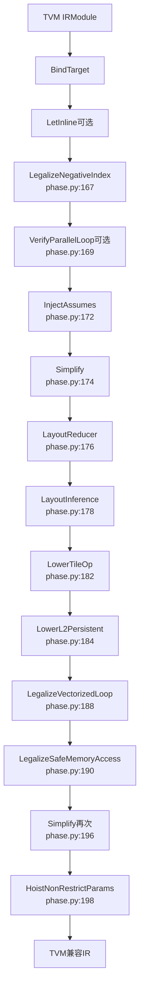

# TileLang 与 Numba-CUDA 底层实现对比分析

## 目录

1. [概述](#概述)
2. [Numba-CUDA 实现详解](#numba-cuda-实现详解)
3. [TileLang 实现详解](#tilelang-实现详解)
4. [对比分析](#对比分析)
5. [总结](#总结)

---

## 概述

本文档深入对比分析 TileLang 和 Numba-CUDA 两个 Python GPU 加速框架的底层实现机制，重点关注：

- **装饰器机制**：定义阶段与调用阶段的区别
- **编译流程**：从 Python 代码到 PTX 的完整路径
- **IR 设计**：中间表示的设计理念
- **优化策略**：不同层次的优化 Pass
- **代码生成**：最终代码生成方式

---

## Numba-CUDA 实现详解

### 一、装饰器机制：定义阶段 vs 调用阶段

#### 1.1 定义阶段（Decorator Application）

**时机**：Python 解释器遇到 `@cuda.jit` 装饰器时

**核心操作**：

1. **参数解析和配置收集** (`decorators.py:267-279`)
   - 收集编译选项（debug、lineinfo、opt 等）
   - 保存到 `targetoptions` 字典

2. **创建 CUDADispatcher 对象** (`decorators.py:280`)
   - 保存原始 Python 函数对象 (`py_func`)
   - 保存编译选项 (`targetoptions`)
   - 初始化编译器 (`_FunctionCompiler`)
   - 初始化缓存机制

3. **Dispatcher 初始化** (`dispatcher.py:1506-1553`)
   - 提取函数签名 (`pysig`)
   - 创建类型上下文和目标上下文
   - 初始化 `overloads` 字典（用于缓存编译结果）
   - 设置 specialization 标志

4. **函数包装** (`dispatcher.py:1532`)
   - 使用 `functools.update_wrapper` 将 Dispatcher 对象伪装成原函数
   - 保留原函数的元数据（`__name__`, `__doc__` 等）

**关键特点**：
- ✅ **不进行编译**：定义阶段只创建 Dispatcher 对象
- ✅ **不分析字节码**：字节码分析延迟到第一次调用时
- ✅ **轻量级操作**：只是对象创建和配置保存，开销很小

#### 1.2 调用阶段（Function Invocation）

**时机**：用户调用被装饰的函数时，Dispatcher 的 `__call__` 方法被触发

**完整流程**：



**详细步骤**：

1. **类型推断** (`dispatcher.py:1652-1655`)
   - 根据实际参数值推断类型
   - 支持 CUDA Array Interface 等扩展类型

2. **编译触发** (`dispatcher.py:1646-1650`)
   - 如果缓存中没有对应类型的编译结果，触发编译

3. **编译过程** (`dispatcher.py:1828-1871`)
   - **字节码提取**：从 `py_func.__code__` 提取字节码
   - **字节码翻译**：`CUDATranslateBytecode` 将字节码转换为 Numba IR
   - **类型推断**：添加类型信息
   - **Lowering**：Numba IR → LLVM IR → NVVM IR
   - **PTX 生成**：通过 NVRTC 编译为 PTX

4. **缓存管理** (`dispatcher.py:1836-1863`)
   - 检查 `self.overloads[args]` 是否已存在
   - 如果不存在，进行编译并缓存结果
   - 支持磁盘缓存（如果启用）

5. **Kernel 启动** (`dispatcher.py:1644`)
   - 调用 `kernel.launch()` 启动 GPU kernel

**关键特点**：
- ⚡ **延迟编译**：只有在第一次调用时才编译
- ⚡ **按需编译**：每种参数类型组合只编译一次
- ⚡ **缓存机制**：编译结果缓存在内存和磁盘中

### 二、编译流程架构

#### 2.1 完整编译流程

```
Python函数 + @cuda.jit装饰器
    ↓
CUDADispatcher
    ↓
CUDACompiler.define_pipelines
    ↓
Untyped Passes
    ↓
CUDATranslateBytecode (字节码 → Numba IR)
    ↓
FuncIR - 无类型IR
    ↓
Typed Passes
    ↓
Typed IR
    ↓
CUDA Lowering Pipeline
    ↓
IRLegalization → AnnotateTypes → CreateLibrary → CUDANativeLowering
    ↓
LLVM IR
    ↓
CUDABackend
    ↓
NVVM IR
    ↓
NVRTC编译
    ↓
PTX代码
```

#### 2.2 数据流架构



### 三、CUDADispatcher 核心机制

#### 3.1 Dispatcher 的作用

`CUDADispatcher` 是 Numba-CUDA 的核心组件，负责：

1. **编译管理和缓存**
   - 管理多个编译变体（overloads），每个变体对应不同的参数类型组合
   - 缓存已编译的 kernel，避免重复编译

2. **类型推断和分发**
   - 在运行时根据实际参数类型进行类型推断
   - 根据参数类型选择合适的已编译 kernel，或触发新的编译
   - 支持多态：同一个函数可以有不同的类型签名

3. **Kernel 启动管理**
   - 管理 kernel 的启动配置（griddim, blockdim, stream, sharedmem）
   - 通过 `configure()` 方法配置启动参数

4. **Specialization 支持**
   - 支持创建专门化的 Dispatcher，针对特定参数类型优化
   - 可以禁用编译功能，只使用预编译的变体，提高启动速度

#### 3.2 为什么不能直接调用 `CUDADispatcher.__call__`？

**原因**：CUDA Kernel 需要启动配置

CUDA kernel 启动必须指定：
- **`griddim`** (grid dimensions): 网格维度
- **`blockdim`** (block dimensions): 线程块维度
- **`stream`** (可选): CUDA 流
- **`sharedmem`** (可选): 动态共享内存大小

**设计理念**：强制显式配置

```python
# ❌ 错误：直接调用会抛出 ValueError
kernel = cuda.jit(my_func)
kernel(args)  # ValueError: Kernel launch configuration was not specified

# ✅ 正确：必须先配置启动参数
kernel[griddim, blockdim](args)  # 使用 __getitem__ 配置
```

#### 3.3 字节码 vs AST

**为什么使用字节码而不是 AST？**

1. **字节码是执行语义的直接表示**
   - Python 字节码是 Python 解释器已经处理过的中间表示
   - 字节码更接近实际的执行语义，而 AST 更接近语法结构

2. **直接访问函数对象**
   - 可以直接从函数对象获取字节码：`func.__code__.co_code`
   - 不需要解析源代码文件，避免了文件路径、编码等问题

3. **字节码包含完整信息**
   - 字节码包含局部变量名、常量、全局变量引用等完整信息
   - 字节码已经处理了作用域嵌套、闭包变量捕获等

4. **与 Python 解释器一致**
   - 字节码是 Python 解释器实际执行的格式
   - 使用字节码可以确保 Numba 的行为与 Python 解释器一致

5. **性能考虑**
   - 字节码解析比 AST 解析更快
   - 字节码已经经过 Python 编译器的优化

#### 3.3.1 IR 和 AST 的关系

**核心概念**：IR（Intermediate Representation，中间表示）和 AST（Abstract Syntax Tree，抽象语法树）都是源代码的中间表示形式，但它们在抽象层次、用途和表示方式上有重要区别。

##### 一、基本定义

**1.1 AST（Abstract Syntax Tree，抽象语法树）**

**定义**：AST 是源代码的**语法结构**的树形表示，反映了代码的**语法层次**。

**特点**：
- ✅ 表示**语法结构**（语句、表达式、操作符等）
- ✅ 保留源代码的**语法层次**
- ✅ 与源代码**结构对应**
- ❌ 不直接表示**执行语义**
- ❌ 不包含**类型信息**（通常）

**示例**：

**Python 代码**:
```python
x = a + b * c
```

**AST 表示**:
```
Assign(
    target=Name(id='x'),
    value=BinOp(
        left=Name(id='a'),
        op=Add(),
        right=BinOp(
            left=Name(id='b'),
            op=Mult(),
            right=Name(id='c')
        )
    )
)
```

**1.2 IR（Intermediate Representation，中间表示）**

**定义**：IR 是源代码的**执行语义**的表示，更接近**实际执行**的格式。

**特点**：
- ✅ 表示**执行语义**（操作、控制流等）
- ✅ 使用**基本块**和**控制流图**
- ✅ 支持**SSA 形式**（单静态赋值）
- ✅ 可以包含**类型信息**
- ❌ 不保留源代码的**语法结构**

**示例**：

**Python 代码**:
```python
x = a + b * c
```

**IR 表示**（Numba IR）:
```
label 0:
    mul_result = binop(operator.mul, b, c)  # 先计算 b * c
    add_result = binop(operator.add, a, mul_result)  # 再计算 a + result
    assign(add_result, x)  # 赋值给 x
```

##### 二、Python 编译流程中的位置

**2.1 Python 标准编译流程**

```
Python 源代码
    ↓
词法分析（Lexical Analysis）
    ↓
语法分析（Syntax Analysis）
    ↓
AST（抽象语法树）
    ↓
字节码生成（Bytecode Generation）
    ↓
Python 字节码（.pyc）
    ↓
Python 解释器执行
```

**2.2 Numba 编译流程**

```
Python 源代码
    ↓
Python 编译器（内置）
    ↓
Python 字节码（.pyc）
    ↓
Numba 字节码解释器
    ↓
Numba IR（FuncIR）
    ↓
类型推断
    ↓
Typed IR
    ↓
LLVM IR
    ↓
PTX
```

**关键点**：
- Numba **跳过 AST**，直接使用字节码
- 字节码是 Python 编译器从 AST 生成的
- Numba IR 从字节码生成，而不是从 AST

**2.3 TileLang 编译流程**

```
Python 源代码
    ↓
Python AST（可能）
    ↓
Tile DSL 构建
    ↓
Tile IR
    ↓
TVM IR
    ↓
CUDA C++
    ↓
PTX
```

**关键点**：
- TileLang 可能使用 AST 来构建 DSL
- Tile IR 是高级 DSL IR，不是从 AST 直接转换

##### 三、AST vs IR 的对比

**3.1 抽象层次**

| 特性 | AST | IR |
|------|-----|-----|
| **抽象层次** | 语法层次 | 执行语义层次 |
| **表示方式** | 树形结构 | 基本块 + 控制流图 |
| **保留信息** | 语法结构 | 操作语义 |
| **类型信息** | 通常无 | 可以有（Typed IR） |

**3.2 结构对比**

**AST 结构**（树形）：

```
FunctionDef
├── name: "add"
├── args: Arguments
│   ├── arg: "a"
│   ├── arg: "b"
│   └── arg: "c"
└── body: [
    ├── If
    │   ├── test: Compare
    │   │   ├── left: Name("i")
    │   │   ├── ops: [Lt()]
    │   │   └── comparators: [Attribute(Name("c"), "size")]
    │   └── body: [
    │       └── Assign
    │           ├── target: Subscript(Name("c"), Name("i"))
    │           └── value: BinOp
    │               ├── left: Subscript(Name("a"), Name("i"))
    │               ├── op: Add()
    │               └── right: Subscript(Name("b"), Name("i"))
    └── ...
]
```

**IR 结构**（基本块）：

```
label 0:
    i = call cuda.grid(1)
    size = getattr(c, 'size')
    cond = binop(operator.lt, i, size)
    branch cond, label 1, label 2

label 1:
    a_i = getitem(a, i)
    b_i = getitem(b, i)
    result = binop(operator.add, a_i, b_i)
    setitem(c, i, result)
    jump label 2

label 2:
    return
```

**3.3 操作表示对比**

**AST**：
- 使用**语法节点**（`BinOp`, `Call`, `Subscript` 等）
- 反映**语法结构**（操作符优先级、括号等）
- 嵌套结构表示表达式

**IR**：
- 使用**操作节点**（`binop`, `call`, `getitem` 等）
- 反映**执行顺序**（操作顺序、中间变量）
- 线性序列表示操作

##### 四、为什么 Numba 使用字节码而不是 AST？

**4.1 字节码的优势**

**1. 执行语义的直接表示**

```python
# Python 代码
x = a + b * c

# AST（语法结构）
BinOp(left=a, op=Add(), right=BinOp(left=b, op=Mult(), right=c))

# 字节码（执行顺序）
LOAD_FAST a
LOAD_FAST b
LOAD_FAST c
BINARY_MULTIPLY  # 先计算 b * c
BINARY_ADD       # 再计算 a + result
STORE_FAST x

# IR（执行语义）
mul_result = binop(operator.mul, b, c)
add_result = binop(operator.add, a, mul_result)
assign(add_result, x)
```

字节码和 IR 都反映了**执行顺序**，而 AST 反映的是**语法结构**。

**2. 直接访问函数对象**

```python
# 从函数对象直接获取字节码
func.__code__.co_code  # 字节码
func.__code__.co_consts  # 常量
func.__code__.co_names  # 全局变量名
```

不需要：
- 解析源代码文件
- 处理文件路径、编码等问题
- 重新进行词法和语法分析

**3. 字节码已经处理了复杂情况**

字节码已经处理了：
- 作用域解析
- 闭包变量捕获
- 全局变量引用
- 常量折叠

**4. 与 Python 解释器一致**

字节码是 Python 解释器实际执行的格式，使用字节码可以确保 Numba 的行为与 Python 解释器一致。

**4.2 AST 的局限性**

**1. 需要源代码**

```python
# AST 需要源代码
import ast
tree = ast.parse(source_code)  # 需要源代码字符串
```

**2. 语法结构 vs 执行语义**

AST 反映语法结构，但执行语义可能不同：

```python
# 语法上：x = a + b * c
# 执行上：先计算 b * c，再计算 a + result
```

**3. 需要重新处理**

从 AST 生成 IR 需要：
- 处理操作符优先级
- 处理作用域
- 处理闭包
- 处理控制流

##### 五、AST 到 IR 的转换

**5.1 转换过程**

如果要从 AST 生成 IR，需要：

```
AST
    ↓
语义分析（Semantic Analysis）
    ↓
作用域解析（Scope Resolution）
    ↓
控制流分析（Control Flow Analysis）
    ↓
IR 生成（IR Generation）
    ↓
IR
```

**5.2 转换示例**

**AST**:
```python
If(
    test=Compare(left=Name('i'), ops=[Lt()], comparators=[Attribute(Name('c'), 'size')]),
    body=[
        Assign(
            target=Subscript(Name('c'), Name('i')),
            value=BinOp(
                left=Subscript(Name('a'), Name('i')),
                op=Add(),
                right=Subscript(Name('b'), Name('i'))
            )
        )
    ]
)
```

**转换为 IR**:
```
label 0:
    i = var('i')
    c = var('c')
    size = getattr(c, 'size')
    cond = binop(operator.lt, i, size)
    branch cond, label 1, label 2

label 1:
    a_i = getitem(a, i)
    b_i = getitem(b, i)
    result = binop(operator.add, a_i, b_i)
    setitem(c, i, result)
    jump label 2

label 2:
    # ...
```

##### 六、在 Numba 和 TileLang 中的应用

**6.1 Numba：字节码 → IR**

**流程**:
```
Python 源代码
    ↓ (Python 编译器)
Python 字节码
    ↓ (CUDATranslateBytecode)
Numba IR
```

**原因**：
- ✅ 字节码已经包含执行语义
- ✅ 不需要重新解析源代码
- ✅ 与 Python 解释器一致
- ✅ 性能更好

**6.2 TileLang：可能使用 AST**

**流程**（推测）:
```
Python 源代码
    ↓ (可能使用 AST)
Tile DSL 构建
    ↓
Tile IR
```

**原因**：
- TileLang 使用 DSL builder 模式
- 可能需要 AST 来构建 DSL
- Tile IR 是高级 DSL IR，不是低级执行 IR

##### 七、总结对比

**7.1 AST vs IR**

| 维度 | AST | IR |
|------|-----|-----|
| **抽象层次** | 语法层次 | 执行语义层次 |
| **表示方式** | 树形结构 | 基本块 + 控制流图 |
| **保留信息** | 语法结构、操作符优先级 | 操作顺序、控制流 |
| **类型信息** | 通常无 | 可以有（Typed IR） |
| **用途** | 语法分析、代码生成 | 优化、代码生成 |
| **转换** | 源代码 → AST | AST/字节码 → IR |

**7.2 关系总结**

1. **AST 是语法表示**：反映源代码的语法结构
2. **IR 是语义表示**：反映代码的执行语义
3. **转换关系**：AST → 字节码 → IR（在 Python 中）
4. **Numba 的选择**：跳过 AST，直接使用字节码生成 IR
5. **原因**：字节码已经包含执行语义，更接近 IR

**7.3 关键区别**

**AST**：
- 树形结构
- 语法层次
- 保留语法信息（括号、优先级等）
- 需要语义分析才能执行

**IR**：
- 基本块结构
- 执行语义
- 保留操作顺序和控制流
- 可以直接用于代码生成和优化

**关系**：
- AST 是**语法**的中间表示
- IR 是**语义**的中间表示
- 两者都是源代码的不同抽象层次
- IR 通常从 AST 或字节码生成，而不是直接从源代码生成

#### 3.3.2 DSL 和 IR 的关系

**核心概念**：DSL（Domain-Specific Language，领域特定语言）和 IR（Intermediate Representation，中间表示）是编译流程中的两个不同阶段，DSL 是用户接口，IR 是编译器内部表示。

##### 一、基本定义

**1.1 DSL（Domain-Specific Language，领域特定语言）**

**定义**：DSL 是专门针对特定问题域设计的编程语言，与通用编程语言（GPL）相对。

**特点**：
- ✅ **领域特定**：针对特定问题域（如 GPU 计算、数据库查询）
- ✅ **表达力强**：在特定领域内提供更直观、更高效的表达方式
- ✅ **语法简化**：通常比通用语言更简洁，专注于领域概念
- ✅ **宿主语言**：可以嵌入到通用语言中（如 Python），也可以独立存在

**分类**：
1. **外部 DSL**：独立的语言，有自己的语法和解析器（如 SQL、正则表达式）
2. **内部 DSL**：嵌入在宿主语言中，使用宿主语言的语法（如 TileLang、SQLAlchemy）

**示例**：

**TileLang DSL**（内部 DSL，嵌入在 Python 中）:
```python
import tilelang.language as T

@T.prim_func
def add_kernel(
    A: T.Tensor((N,), 'float32'),
    B: T.Tensor((N,), 'float32'),
    C: T.Tensor((N,), 'float32'),
):
    with T.Kernel(1) as _:
        for i in T.serial(N):
            C[i] = A[i] + B[i]
```

**1.2 IR（Intermediate Representation，中间表示）**

**定义**：IR 是编译器内部使用的中间表示形式，用于表示程序的执行语义。

**特点**：
- ✅ **执行语义**：表示程序的实际执行逻辑
- ✅ **结构优化**：使用基本块、控制流图等结构
- ✅ **类型信息**：可以包含类型信息（Typed IR）
- ✅ **编译器内部**：主要用于编译器内部的转换和优化

**示例**：

**Tile IR**（TVM TIR）:
```python
# Tile IR 表示（简化）
@T.prim_func
def add_kernel(A: T.Buffer((N,), "float32"), 
               B: T.Buffer((N,), "float32"),
               C: T.Buffer((N,), "float32")):
    for i in T.serial(N):
        C[i] = A[i] + B[i]
```

##### 二、DSL 和 IR 的关系

**2.1 转换关系**

**基本流程**：

```
用户编写的 DSL 代码
    ↓
DSL 解析/转换
    ↓
IR（中间表示）
    ↓
优化 Pass
    ↓
代码生成
    ↓
目标代码（CUDA C++、PTX 等）
```

**在 TileLang 中**：

```
Python DSL（@T.prim_func 装饰的函数）
    ↓
AST 转换（mutate 函数）
    ↓
Tile IR（TVM TIR）
    ↓
Lowering Passes
    ↓
TVM IR（优化后）
    ↓
CUDA C++ 代码生成
    ↓
PTX
```

**2.2 DSL 到 IR 的转换过程**

**TileLang 的实现** (`tilelang/language/eager/builder.py`):

```python
def prim_func(func: Callable[_P, _T] = None, *, eager_jit: bool = False):
    def impl(func: Callable[_P, _T]):
        # 1. 获取函数签名和类型注解
        sig = inspect.signature(func)
        func_annot = get_type_hints(func)
        
        # 2. 将 Python 函数转换为 IR 生成器
        ir_gen = mutate(func)  # DSL → IR Generator
        
        # 3. 构建 IR
        builder = Builder()
        with builder.prim_func(func.__name__):
            ir_gen.gen(builder)(**annot)  # 生成 Tile IR
        
        prim_func = builder.get()  # 获取 Tile IR
        return prim_func
    
    return impl(func) if func is not None else impl
```

**mutate 函数** (`tilelang/language/eager/ast.py:641`):

```python
def mutate(func: Callable[_P, _T]) -> IRGenerator[_P, _T]:
    """
    Transform a Python function into an IR (Intermediate Representation) generator.
    This function takes a regular Python function and performs AST (Abstract Syntax Tree)
    transformation to create an IRGenerator that can be used for code generation purposes.
    """
    # 1. 获取 Python 函数的 AST
    tree = utils.get_ast(func)
    
    # 2. 使用 DSLMutator 转换 AST
    mut = DSLMutator(nonlocals, func.__globals__, Path(filename).name)
    tree = mut.visit(tree)  # AST 转换
    
    # 3. 编译为 IR 生成器
    make_closure = compile(tree, filename, 'exec')
    # ...
    return IRGenerator(gen=..., source=...)
```

##### 三、DSL vs IR 的对比

**3.1 抽象层次**

| 维度 | DSL | IR |
|------|-----|-----|
| **抽象层次** | 用户友好的高级抽象 | 编译器内部的中级抽象 |
| **目标用户** | 开发者 | 编译器 |
| **表达方式** | 领域特定的语法 | 结构化的中间表示 |
| **可读性** | 高（接近自然语言） | 中（结构化但可读） |
| **可执行性** | 否（需要转换） | 是（可以用于代码生成） |

**3.2 表示方式对比**

**DSL 代码**（用户编写）:
```python
@T.prim_func
def matmul_kernel(
    A: T.Tensor((M, K), 'float32'),
    B: T.Tensor((K, N), 'float32'),
    C: T.Tensor((M, N), 'float32'),
):
    with T.Kernel(1) as _:
        for i, j in T.grid(M, N):
            C[i, j] = 0.0
            for k in T.serial(K):
                C[i, j] += A[i, k] * B[k, j]
```

**Tile IR**（编译器内部）:
```python
# Tile IR（TVM TIR 格式，简化表示）
@T.prim_func
def matmul_kernel(
    A: T.Buffer((M, K), "float32"),
    B: T.Buffer((K, N), "float32"),
    C: T.Buffer((M, N), "float32"),
):
    for i, j in T.grid(M, N):
        C[i, j] = T.float32(0)
        for k in T.serial(K):
            C[i, j] = C[i, j] + A[i, k] * B[k, j]
```

**关键区别**：
- **DSL**：使用 `T.Tensor`、`with T.Kernel` 等高级抽象
- **IR**：使用 `T.Buffer`、显式循环等更底层的表示

**3.3 功能对比**

**DSL**：
- ✅ 提供领域特定的抽象（tile、memory hierarchy）
- ✅ 隐藏底层细节（内存管理、线程同步）
- ✅ 提供库函数（`T.gemm`、`T.reduce`）
- ❌ 不能直接执行，需要转换为 IR

**IR**：
- ✅ 表示执行语义
- ✅ 可以进行优化（循环展开、内存合并等）
- ✅ 可以用于代码生成
- ❌ 对用户不够友好

##### 四、在 Numba 和 TileLang 中的应用

**4.1 Numba：没有显式 DSL**

**Numba-CUDA 流程**：

```
Python 代码（通用语言）
    ↓
Python 字节码
    ↓
Numba IR（FuncIR）
    ↓
LLVM IR
    ↓
PTX
```

**特点**：
- Numba **没有显式的 DSL**
- 直接使用 Python 作为"DSL"（通过 `@cuda.jit` 装饰器）
- Python 代码本身就是用户友好的抽象
- 字节码直接转换为 Numba IR

**4.2 TileLang：显式 DSL**

**TileLang 流程**：

```
Python DSL（@T.prim_func）
    ↓
AST 转换（mutate）
    ↓
Tile IR（TVM TIR）
    ↓
Lowering Passes
    ↓
TVM IR（优化后）
    ↓
CUDA C++ 代码生成
    ↓
PTX
```

**特点**：
- TileLang **有显式的 DSL**
- DSL 提供领域特定的抽象（tile、memory hierarchy）
- DSL 代码通过 AST 转换生成 Tile IR
- Tile IR 是 TVM TIR 的扩展，包含 tile 相关的操作

**DSL 到 IR 的转换**：

```python
# 用户编写的 DSL
@T.prim_func
def add_kernel(A: T.Tensor((N,), 'float32'), 
               B: T.Tensor((N,), 'float32'),
               C: T.Tensor((N,), 'float32')):
    with T.Kernel(1) as _:
        for i in T.serial(N):
            C[i] = A[i] + B[i]

# 转换为 Tile IR（编译器内部）
# T.Tensor → T.Buffer
# with T.Kernel → 线程绑定
# T.serial → for 循环
```

#### 3.3.3 TileLang DSL 实现机制详解

**核心机制**：TileLang 的 DSL 语法元素（如 `T.Parallel`、`T.serial` 等）**不会转换为 Python IR**，而是直接返回 DSL 特定的对象（如 `ForFrame`），这些对象在 builder 中直接用于构建 Tile IR。

##### 一、DSL 语法元素是函数，但返回 DSL 对象

**`T.Parallel` 的实现** (`tilelang/language/loop.py:13`):

```python
def Parallel(
    *extents: tir.PrimExpr,
    coalesced_width: int | None = None,
    loop_layout: Any | None = None,
):
    """Tools to construct nested parallel for loop."""
    annotations: dict[str, Any] = {}
    if coalesced_width is not None:
        annotations["coalesced_width"] = coalesced_width
    if loop_layout is not None:
        annotations["parallel_loop_layout"] = loop_layout
    return _ffi_api.Parallel(extents, annotations)  # 返回 ForFrame 对象
```

**关键点**：
- `T.Parallel` **是一个 Python 函数**
- 但它返回的是 `ForFrame` 对象（DSL 特定的对象），**不是普通的 Python 值**
- `ForFrame` 是 TVM IR Builder 的框架对象，用于构建 Tile IR

##### 二、DSL 语法元素不会转换为 Python IR

**用户编写的 DSL 代码**:
```python
@T.prim_func
def add_kernel(A: T.Tensor((N,), 'float32'), C: T.Tensor((N,), 'float32')):
    for i in T.Parallel(N):  # T.Parallel 在这里被调用
        C[i] = A[i] + 1
```

**执行流程**：

1. **Python 执行时**：
   - `T.Parallel(N)` **被调用**，返回 `ForFrame` 对象
   - `for i in T.Parallel(N)` 中的 `T.Parallel(N)` 返回的是 `ForFrame`，**不是 Python IR**

2. **DSL Mutator 转换** (`tilelang/language/eager/ast.py:304`):
   ```python
   def visit_For(self, node: ast.For):
       # 将 for i in T.Parallel(N) 转换为
       # for tmp in __tb.ctx_for(T.Parallel(N))
       return quote(
           f"for {tmp} in __tb.ctx_for(range):\n  pass\n",
           range=node.iter,  # T.Parallel(N) 在这里
           ...
       )
   ```

3. **Builder 处理** (`tilelang/language/eager/builder.py:314`):
   ```python
   def ctx_for(self, it):
       it = unwrap_expr(it)  # 展开表达式
       
       # 检查是否是 ForFrame（由 T.Parallel 等返回）
       if not isinstance(it, tir.frame.ForFrame):
           raise TypeError("Invalid for loop, expect T.serial, T.grid, T.parallel, ...")
       
       # 直接使用 ForFrame 构建 Tile IR
       with self.with_frame(it) as v:
           yield v
   ```

**关键点**：
- `T.Parallel(N)` **不会转换为 Python IR**
- 它返回 `ForFrame` 对象，这个对象**直接用于构建 Tile IR**
- DSL 语法元素在 Python 执行时就被"解释"了，返回 DSL 特定的对象

##### 三、DSL Builder 模式

**两阶段转换**：

**阶段 1：AST 转换（DSL Mutator）**

```python
# 用户代码
for i in T.Parallel(N):
    C[i] = A[i] + 1

# DSLMutator 转换后
for tmp in __tb.ctx_for(T.Parallel(N)):
    # 循环体
```

**阶段 2：运行时构建（Builder）**

```python
# 当函数执行时
def gen(builder):
    # T.Parallel(N) 被调用，返回 ForFrame
    for_frame = T.Parallel(N)  # 返回 ForFrame 对象
    
    # Builder.ctx_for 接收 ForFrame
    for v in builder.ctx_for(for_frame):
        # 使用 ForFrame 构建 Tile IR
        # ...
```

##### 四、完整流程示例

**用户代码**:
```python
@T.prim_func
def add_kernel(A: T.Tensor((N,), 'float32'), C: T.Tensor((N,), 'float32')):
    for i in T.Parallel(N):
        C[i] = A[i] + 1
```

**执行流程**：

1. **Python 执行时**：
   ```python
   # T.Parallel(N) 被调用，返回 ForFrame
   for_frame = T.Parallel(N)  # 返回 ForFrame 对象
   ```

2. **Builder 处理**：
   ```python
   # builder.ctx_for 接收 ForFrame
   for v in builder.ctx_for(for_frame):
       # 直接使用 ForFrame 构建 Tile IR
       builder.eval(C[v] = A[v] + 1)
   ```

3. **构建 Tile IR**：
   ```python
   # builder.with_frame(for_frame) 内部
   # 直接调用 TVM IR Builder 构建 Tile IR
   with tir.parallel(N) as i:  # 这是 Tile IR，不是 Python IR
       C[i] = A[i] + 1
   ```

##### 五、为什么 DSL 语法元素不转换为 Python IR？

**设计原因**：

1. **DSL 特定的语义**：
   - `T.Parallel` 表示并行循环，这是 DSL 特定的概念
   - Python IR 没有对应的概念（Python 只有普通的 for 循环）

2. **直接构建 Tile IR**：
   - `ForFrame` 对象可以直接用于构建 Tile IR
   - 不需要经过 Python IR 的中间表示

3. **性能考虑**：
   - 避免不必要的转换步骤
   - 直接构建目标 IR 更高效

**对比：普通 Python 代码**

**普通 Python 代码**：
```python
for i in range(N):
    C[i] = A[i] + 1
```

**处理方式**：
- `range(N)` 返回 Python 的 range 对象
- DSLMutator 需要将其转换为 DSL 语法
- 或者直接使用 `T.serial(N)`

**DSL 语法**：
```python
for i in T.Parallel(N):
    C[i] = A[i] + 1
```

**处理方式**：
- `T.Parallel(N)` 直接返回 `ForFrame` 对象
- **不需要转换**，直接用于构建 Tile IR

##### 六、总结

**核心机制**：

1. **DSL 语法元素是函数**：
   - `T.Parallel`、`T.serial` 等是 Python 函数
   - 但它们返回 DSL 特定的对象（如 `ForFrame`）

2. **不转换为 Python IR**：
   - DSL 语法元素**不会对应到 Python IR**
   - 它们返回的对象直接用于构建 Tile IR

3. **DSL Builder 模式**：
   - DSL Mutator 将 Python AST 转换为调用 builder 的代码
   - Builder 在执行时接收 DSL 对象，直接构建 Tile IR

**关键点**：

- ✅ **DSL 语法元素是函数**：`T.Parallel` 是一个函数
- ✅ **返回 DSL 对象**：返回 `ForFrame`，不是 Python IR
- ✅ **直接构建 Tile IR**：`ForFrame` 直接用于构建 Tile IR
- ✅ **不经过 Python IR**：没有 Python IR 的中间表示

**用户理解正确**：
> "我认为最终应该是 DSL 的一个语法元素就终止解释了，不会对应到 Python IR"

**确实如此**：
- DSL 语法元素（如 `T.Parallel`）在 Python 执行时被调用
- 返回 DSL 特定的对象（如 `ForFrame`）
- 这些对象直接用于构建 Tile IR
- **不经过 Python IR 的转换**

#### 3.3.4 _ffi_api.Parallel 实现和 ForFrame 终结性详解

**核心问题**：`_ffi_api.Parallel` 的实现代码是什么？为什么 `ForFrame` 是终结语法元素而不会展开？

##### 一、_ffi_api.Parallel 的实现代码

**Python 层调用** (`tilelang/language/loop.py:72`):

```python
def Parallel(
    *extents: tir.PrimExpr,
    coalesced_width: int | None = None,
    loop_layout: Any | None = None,
):
    annotations: dict[str, Any] = {}
    if coalesced_width is not None:
        annotations["coalesced_width"] = coalesced_width
    if loop_layout is not None:
        annotations["parallel_loop_layout"] = loop_layout
    return _ffi_api.Parallel(extents, annotations)  # 调用 C++ 函数
```

**C++ 层实现** (`tilelang/src/ir.cc:62-102`):

```cpp
ForFrame ParallelFor(const Array<PrimExpr> &extents,
                     const Map<String, tvm::ffi::Any> &annotations) {
  using namespace tvm::tir;
  
  // 1. 创建 ForFrameNode 对象
  ObjectPtr<ForFrameNode> n = tvm::ffi::make_object<ForFrameNode>();
  
  // 2. 为每个 extent 创建循环变量和域
  n->vars.reserve(extents.size());
  n->doms.reserve(extents.size());
  for (const auto &extent : extents) {
    DataType dtype = extent.dtype();
    n->vars.push_back(Var("v", extent.dtype()));  // 创建循环变量
    n->doms.push_back(Range(make_const(dtype, 0), extent));  // 创建域 [0, extent)
  }
  
  // 3. 设置 f_make_for_loop 回调函数
  // 这个函数会在 builder 构建 Tile IR 时被调用
  n->f_make_for_loop =
      [annotations](const Array<Var> &vars, const Array<Range> &doms,
                    const Array<Optional<PrimExpr>> &steps, Stmt body) -> Stmt {
    ICHECK_EQ(vars.size(), doms.size());
    int n = vars.size();
    
    // 从内到外构建嵌套的并行循环
    for (int i = n - 1; i >= 0; --i) {
      Range dom = doms[i];
      Var var = vars[i];
      Optional<PrimExpr> step =
          i < steps.size() ? steps[i] : Optional<PrimExpr>(std::nullopt);
      
      // 只在最外层循环附加 annotations
      Map<String, tvm::ffi::Any> loop_annotations;
      if (i == 0) {
        loop_annotations = annotations;
      }
      
      // 创建 Tile IR 的 For 节点（ForKind::kParallel）
      body = For(var, dom->min, dom->extent, ForKind::kParallel, body,
                 /*thread_binding=*/std::nullopt,
                 /*annotations=*/loop_annotations,
                 /*step=*/step);
    }
    return body;
  };
  
  // 4. 返回 ForFrame 对象
  return ForFrame(n);
}
```

**FFI 注册** (`tilelang/src/ir.cc:329-336`):

```cpp
TVM_FFI_STATIC_INIT_BLOCK() {
  namespace refl = tvm::ffi::reflection;
  refl::GlobalDef()
      .def("tl.Parallel", ParallelFor)  // 注册为 "tl.Parallel"
      .def("tl.Pipelined", PipelinedFor)
      .def("tl.Persistent", PersistentFor)
      .def("tl.KernelLaunch", KernelLaunch);
}
```

##### 二、ForFrame 的结构

**ForFrameNode 的组成**：

```cpp
class ForFrameNode : public TIRFrameNode {
public:
  Array<Var> vars;           // 循环变量列表
  Array<Range> doms;         // 循环域列表
  Function f_make_for_loop;  // 回调函数：用于构建 Tile IR 的 For 节点
  // ...
};
```

**关键字段说明**：

1. **`vars`**：循环变量列表
   - 例如：`T.Parallel(M, N)` 会创建两个变量 `v0` 和 `v1`

2. **`doms`**：循环域列表
   - 例如：`T.Parallel(M, N)` 会创建两个域 `[0, M)` 和 `[0, N)`

3. **`f_make_for_loop`**：回调函数（**关键**）
   - **延迟执行**：这个函数不会在 `T.Parallel(N)` 调用时执行
   - **执行时机**：它会在 builder 构建 Tile IR 时被调用
   - **作用**：接收循环变量、域、步长和循环体，返回 Tile IR 的 `For` 节点

##### 三、为什么 ForFrame 是终结语法元素？

**1. ForFrame 是 DSL 特定的对象**

```python
# T.Parallel(N) 返回 ForFrame
for_frame = T.Parallel(N)  # 返回 ForFrame 对象

# ForFrame 不是 Python IR，也不是 Tile IR
# 它是一个 DSL Builder 的框架对象
```

**2. ForFrame 包含构建 Tile IR 所需的所有信息**

`ForFrame` 已经包含了构建 Tile IR 所需的所有信息：
- 循环变量（`vars`）
- 循环域（`doms`）
- 构建函数（`f_make_for_loop`）

**3. ForFrame 直接用于构建 Tile IR**

**Builder 使用 ForFrame** (`tilelang/language/eager/builder.py:314`):

```python
def ctx_for(self, it):
    it = unwrap_expr(it)
    
    # 检查是否是 ForFrame
    if not isinstance(it, tir.frame.ForFrame):
        raise TypeError("Invalid for loop")
    
    # 直接使用 ForFrame 构建 Tile IR
    with self.with_frame(it) as v:
        yield v
```

**`with_frame` 内部**（TVM IR Builder）:

```cpp
// TVM IR Builder 内部
template<typename TFrame>
auto with_frame(TFrame frame) {
  // 1. 进入 frame 的作用域
  frame->EnterWithScope();
  
  // 2. 构建循环体
  Stmt body = ...;
  
  // 3. 调用 f_make_for_loop 构建 Tile IR 的 For 节点
  Stmt for_stmt = frame->f_make_for_loop(
      frame->vars, 
      frame->doms, 
      steps, 
      body
  );
  
  // 4. 返回构建好的 Tile IR
  return for_stmt;
}
```

**4. ForFrame 不会进一步展开**

**为什么 ForFrame 不会展开？**

1. **ForFrame 已经是 DSL Builder 可以直接使用的对象**
   - 它包含了构建 Tile IR 所需的所有信息
   - 不需要进一步转换或展开

2. **f_make_for_loop 是延迟执行的**
   - `f_make_for_loop` 不会在 `T.Parallel(N)` 调用时执行
   - 它会在 builder 构建 Tile IR 时被调用
   - 这是**延迟构建**（lazy construction）的模式

3. **ForFrame 是终结语法元素**
   - `T.Parallel(N)` → `ForFrame`（终结）
   - `ForFrame` → Tile IR 的 `For` 节点（在 builder 中构建）

**对比：普通 Python 对象 vs ForFrame**

**普通 Python 对象**：

```python
# range(N) 返回 Python 的 range 对象
for i in range(N):
    pass

# range 对象需要进一步处理
# 可能需要转换为 T.serial(N)
```

**ForFrame（DSL 对象）**：

```python
# T.Parallel(N) 返回 ForFrame
for i in T.Parallel(N):
    pass

# ForFrame 不需要进一步处理
# 它直接用于构建 Tile IR
```

**关键区别**：
- **普通 Python 对象**：需要转换为 DSL 对象
- **ForFrame**：已经是 DSL 对象，**不需要转换**

##### 四、完整执行流程

**用户代码**:
```python
@T.prim_func
def add_kernel(A: T.Tensor((N,), 'float32'), C: T.Tensor((N,), 'float32')):
    for i in T.Parallel(N):
        C[i] = A[i] + 1
```

**执行流程**：

1. **Python 调用 `T.Parallel(N)`**
   ```python
   for_frame = T.Parallel(N)  # 调用 _ffi_api.Parallel
   ```

2. **C++ 创建 ForFrame**
   ```cpp
   ForFrame ParallelFor(extents, annotations) {
     ObjectPtr<ForFrameNode> n = ...;
     n->vars = [Var("v", dtype)];
     n->doms = [Range(0, N)];
     n->f_make_for_loop = [annotations](...) -> Stmt {
       // 延迟执行的函数
       return For(var, min, extent, ForKind::kParallel, body, ...);
     };
     return ForFrame(n);
   }
   ```

3. **返回 ForFrame 到 Python**
   ```python
   for_frame = T.Parallel(N)  # 返回 ForFrame 对象
   # ForFrame 包含：
   #   - vars: [Var("v")]
   #   - doms: [Range(0, N)]
   #   - f_make_for_loop: lambda 函数
   ```

4. **Builder 使用 ForFrame**
   ```python
   for v in builder.ctx_for(for_frame):
       # builder.with_frame(for_frame) 内部：
       #   1. 调用 for_frame->EnterWithScope()
       #   2. 构建循环体
       #   3. 调用 for_frame->f_make_for_loop(...) 构建 Tile IR
       builder.eval(C[v] = A[v] + 1)
   ```

5. **构建 Tile IR**
   ```cpp
   // TVM IR Builder 内部
   Stmt body = ...;  // 循环体
   Stmt for_stmt = for_frame->f_make_for_loop(
       for_frame->vars,    // [Var("v")]
       for_frame->doms,    // [Range(0, N)]
       steps,              // []
       body               // C[v] = A[v] + 1
   );
   
   // for_stmt 是 Tile IR 的 For 节点：
   // For(v, 0, N, ForKind::kParallel, body, ...)
   ```

##### 五、总结

**核心机制**：

1. **`_ffi_api.Parallel` 的实现**：
   - Python 层调用 `_ffi_api.Parallel(extents, annotations)`
   - C++ 层 `ParallelFor` 函数创建 `ForFrameNode`
   - 设置 `f_make_for_loop` 回调函数
   - 返回 `ForFrame` 对象

2. **ForFrame 的结构**：
   - `vars`：循环变量列表
   - `doms`：循环域列表
   - `f_make_for_loop`：延迟执行的回调函数

3. **为什么 ForFrame 是终结语法元素？**
   - **ForFrame 是 DSL 特定的对象**：包含了构建 Tile IR 所需的所有信息
   - **ForFrame 直接用于构建 Tile IR**：不需要 Python IR 的中间表示
   - **f_make_for_loop 是延迟执行的**：在 builder 构建 Tile IR 时被调用
   - **ForFrame 不会进一步展开**：它是终结语法元素，直接用于构建 Tile IR

**关键点**：

- ✅ **`T.Parallel(N)` 返回 `ForFrame`**：不是 Python IR，也不是 Tile IR
- ✅ **`ForFrame` 包含构建信息**：`vars`、`doms`、`f_make_for_loop`
- ✅ **`f_make_for_loop` 延迟执行**：在 builder 构建 Tile IR 时被调用
- ✅ **`ForFrame` 是终结语法元素**：不会进一步展开，直接用于构建 Tile IR

#### 3.3.5 TileLang Parser 起点：从 Python AST 开始

**核心结论**：TileLang 的 parser **确实是从 Python AST 作为起点**，而不是从更早的 code string tokens 作为起点。这是因为 TileLang 使用 Python 作为宿主语言，可以直接利用 Python 已经完成的词法分析和语法分析。

##### 一、TileLang Parser 的起点

**标准编译流程**：

```
源代码字符串 (Code String)
    ↓
词法分析 (Lexical Analysis) → Tokens
    ↓
语法分析 (Syntax Analysis) → AST
    ↓
语义分析 (Semantic Analysis) → IR
```

**TileLang 的流程**：

```
Python 函数对象
    ↓
inspect.getsource() → 源代码字符串
    ↓
ast.parse() → Python AST ← **TileLang 的起点**
    ↓
DSLMutator → 修改后的 AST
    ↓
IR Generator → Tile IR
```

**关键代码**：

**`get_ast` 函数** (`tilelang/language/eager/utils.py:58`):

```python
def get_ast(func: Callable):
    _, start = inspect.getsourcelines(func)
    filename = inspect.getsourcefile(func) or inspect.getfile(func)
    source = inspect.getsource(func)  # 1. 获取源代码字符串
    source = _remove_leading_ident(source)
    source = "\n" * (start - 1) + source
    tree = ast.parse(source, filename=filename)  # 2. 解析为 Python AST
    return tree
```

**`mutate` 函数** (`tilelang/language/eager/ast.py:667`):

```python
def mutate(func: Callable[_P, _T]) -> IRGenerator[_P, _T]:
    tree = utils.get_ast(func)  # 获取 Python AST
    filename = inspect.getsourcefile(func) or inspect.getfile(func)
    nonlocals = utils.get_func_nonlocals(func)
    
    mut = DSLMutator(nonlocals, func.__globals__, Path(filename).name)
    tree = mut.visit(tree)  # DSLMutator 转换 AST
    # ...
```

##### 二、为什么从 Python AST 开始？

**1. Python 已经完成了词法分析和语法分析**

**Python 的编译流程**：

```python
# Python 源代码
def add_kernel(A, C):
    for i in T.Parallel(N):
        C[i] = A[i] + 1

# Python 编译器已经完成：
# 1. 词法分析：将源代码字符串转换为 tokens
# 2. 语法分析：将 tokens 转换为 AST
```

**TileLang 直接使用 Python AST**：

```python
# TileLang 不需要重新进行词法分析和语法分析
# 直接使用 Python 已经解析好的 AST
tree = ast.parse(source)  # Python 的 ast.parse 已经完成了词法和语法分析
```

**2. 优势**

- **复用 Python 的解析器**：
  - Python 的 `ast.parse()` 已经完成了词法分析和语法分析
  - TileLang 不需要自己实现词法分析器和语法分析器
  - 减少了代码复杂度和维护成本

- **与 Python 语法一致**：
  - TileLang 使用 Python 语法作为 DSL 语法
  - 直接使用 Python AST 确保语法一致性
  - 用户可以使用所有 Python 语法特性

- **性能考虑**：
  - Python 的 AST 解析已经高度优化
  - 不需要重复进行词法分析和语法分析
  - 直接从 AST 开始转换更高效

**3. 对比：从 Tokens 开始 vs 从 AST 开始**

**如果从 Tokens 开始**（假设）：

```python
# 需要自己实现词法分析器
tokens = lexer.tokenize(source_code)
# tokens = [
#     Token('DEF', 'def'),
#     Token('NAME', 'add_kernel'),
#     Token('LPAREN', '('),
#     ...
# ]

# 需要自己实现语法分析器
ast = parser.parse(tokens)
```

**问题**：
- 需要实现词法分析器（lexer）
- 需要实现语法分析器（parser）
- 需要维护语法规则
- 代码复杂度高

**从 AST 开始**（实际）：

```python
# 直接使用 Python 的 ast.parse()
tree = ast.parse(source_code)
# tree 已经是完整的 Python AST
```

**优势**：
- 不需要实现词法分析器和语法分析器
- 直接使用 Python 的解析结果
- 代码简洁，维护成本低

##### 三、TileLang 的 Parser 流程

**完整流程**：

1. **获取源代码**：
   ```python
   # mutate 函数接收 Python 函数对象
   source = inspect.getsource(func)
   # source = "def add_kernel(A, C):\n    for i in T.Parallel(N):\n        C[i] = A[i] + 1"
   ```

2. **解析为 Python AST**：
   ```python
   # 使用 Python 的 ast.parse() 解析源代码
   tree = ast.parse(source, filename=filename)
   # tree 是 Python AST，包含：
   #   - FunctionDef(name='add_kernel', ...)
   #   - For(target=Name(id='i'), iter=Call(...), body=[...])
   ```

3. **DSL Mutator 转换**：
   ```python
   # DSLMutator 转换 Python AST
   mut = DSLMutator(nonlocals, func.__globals__, filename)
   tree = mut.visit(tree)
   # tree 被转换为调用 builder 的代码：
   #   - for tmp in __tb.ctx_for(T.Parallel(N)):
   #       ...
   ```

4. **编译为 IR Generator**：
   ```python
   # 将修改后的 AST 编译为 Python 函数
   make_closure = utils.get_compiled_object(
       tree,
       "make_closure",
       filename,
       func.__globals__
   )
   # make_closure 是一个函数，可以生成 Tile IR
   ```

**关键点**：

- TileLang **不需要**自己实现词法分析（tokenization）
- TileLang **不需要**自己实现语法分析（parsing）
- TileLang **直接使用** Python 已经解析好的 AST

##### 四、对比：Numba vs TileLang

**Numba：从字节码开始**

```
Python 函数对象
    ↓
Python 编译器（内置）
    ↓
Python 字节码 ← **Numba 的起点**
    ↓
CUDATranslateBytecode → Numba IR
```

**特点**：
- Numba 从 Python 字节码开始
- 字节码是 Python 编译器从 AST 生成的
- Numba 跳过 AST，直接使用字节码

**TileLang：从 AST 开始**

```
Python 函数对象
    ↓
inspect.getsource() → 源代码字符串
    ↓
ast.parse() → Python AST ← **TileLang 的起点**
    ↓
DSLMutator → 修改后的 AST
    ↓
IR Generator → Tile IR
```

**特点**：
- TileLang 从 Python AST 开始
- AST 是 Python 解析器从源代码字符串生成的
- TileLang 使用 AST，然后转换为 DSL

**为什么不同？**

- **Numba**：
  - 目标：将 Python 代码编译为机器码
  - 方法：直接使用字节码（执行语义）
  - 原因：字节码更接近执行语义，适合编译

- **TileLang**：
  - 目标：将 Python DSL 转换为 Tile IR
  - 方法：使用 AST（语法结构）
  - 原因：AST 保留语法结构，适合 DSL 转换

##### 五、总结

**核心结论**：

TileLang 的 parser **确实是从 Python AST 作为起点**，而不是从更早的 code string tokens 作为起点。

**原因**：
1. **Python 已经完成了词法分析和语法分析**
   - `ast.parse()` 已经将源代码字符串解析为 AST
   - TileLang 不需要重新进行词法分析和语法分析

2. **复用 Python 的解析器**
   - 减少代码复杂度
   - 确保语法一致性
   - 提高性能

3. **AST 适合 DSL 转换**
   - AST 保留语法结构
   - 适合 DSL Mutator 进行转换
   - 可以转换为 DSL 特定的结构

**流程总结**：

```
Python 函数对象
    ↓
inspect.getsource() → 源代码字符串
    ↓
ast.parse() → Python AST ← **TileLang Parser 的起点**
    ↓
DSLMutator → 修改后的 AST
    ↓
IR Generator → Tile IR
```

**关键点**：

- ✅ **TileLang 从 Python AST 开始**：不需要自己实现词法分析和语法分析
- ✅ **Python 已经完成解析**：`ast.parse()` 已经完成了词法和语法分析
- ✅ **直接使用 Python AST**：TileLang 直接使用 Python 解析好的 AST
- ✅ **DSL Mutator 转换 AST**：将 Python AST 转换为 DSL 特定的结构

#### 3.3.6 Python AST Parser 如何处理 TileLang Primitives

**核心问题**：Python 的 `ast.parse()` 不会理解 `T.Parallel` 这种 TileLang primitives，它会不会过度展开解读成为 Python 标准语言的操作？

**核心答案**：**不会**。Python AST parser 只是按照 Python 语法解析，将 `T.Parallel(N)` 解析为函数调用节点（`Call`），**不会进一步展开或理解其特殊含义**。TileLang primitives 会在运行时执行时被实际调用，返回 DSL 特定的对象（如 `ForFrame`）。

##### 一、Python AST Parser 的行为

**Python AST Parser 的特点**：

- ✅ **只解析语法结构**：按照 Python 语法规则解析源代码
- ✅ **不执行代码**：不会实际执行函数调用
- ✅ **不理解语义**：不知道 `T.Parallel` 的特殊含义
- ✅ **返回 AST 节点**：返回语法树节点，不展开函数调用

**示例**：

```python
# 源代码
for i in T.Parallel(N):
    C[i] = A[i] + 1

# Python AST Parser 解析后
For(
    target=Name(id='i'),
    iter=Call(                    # ← T.Parallel(N) 被解析为 Call 节点
        func=Attribute(
            value=Name(id='T'),
            attr='Parallel'
        ),
        args=[Name(id='N')]
    ),
    body=[...]
)
```

**关键点**：
- `T.Parallel(N)` 被解析为 `Call` 节点
- **不会进一步展开**
- **不会理解其特殊含义**
- 只是一个普通的函数调用 AST 节点

**为什么不会过度展开？**

1. **AST Parser 只解析语法**
   - `ast.parse()` 只是将源代码字符串解析为 AST
   - 它不知道 `T.Parallel` 是什么，只是按照 Python 语法解析为函数调用

2. **不执行代码**
   - AST Parser 不会执行 `T.Parallel(N)`
   - 不会调用函数，不会展开函数体
   - 只是创建 AST 节点

3. **保留原始结构**
   - `T.Parallel(N)` 被保留为 `Call` 节点
   - 不会转换为其他 Python 操作
   - 不会展开为循环或其他结构

##### 二、DSLMutator 如何处理函数调用

**`visit_For` 的实现** (`tilelang/language/eager/ast.py:304`):

```python
def visit_For(self, node: ast.For):
    node = self.generic_visit(node)  # 递归访问所有子节点
    tmp = self.get_tmp()
    var = ast.Name(tmp, ctx=ast.Load())
    ast_set_span(var, ast_get_span(node.target))
    stmts = self._emit_assign_target(node.target, var)
    return quote(
        f"for {tmp} in __tb.ctx_for(range):\n  pass\n",
        target=node.target,
        range=node.iter,  # ← T.Parallel(N) 的 AST 节点被保留在这里
        passes=[stmts + node.body],
        span=node,
    )
```

**关键点**：

1. **`node = self.generic_visit(node)`**：
   - 递归访问 `For` 节点的所有子节点
   - 对于 `node.iter`（即 `T.Parallel(N)` 的 `Call` 节点）
   - `generic_visit` 对于没有特殊处理的节点（如 `Call`），会保留原样

2. **`range=node.iter`**：
   - `node.iter` 就是 `T.Parallel(N)` 的 AST 节点（`Call` 节点）
   - 它被直接保留在 `quote` 函数中
   - 不会进一步展开或转换

**generic_visit 的行为**：

```python
# ast.NodeTransformer.generic_visit 的默认行为
def generic_visit(self, node):
    # 对于没有特殊处理的节点类型，保留原样
    # 对于 Call 节点，如果没有定义 visit_Call，就保留原样
    return node
```

**对于 `Call` 节点**：

- DSLMutator **没有定义 `visit_Call` 方法**
- 所以 `generic_visit` 会保留 `Call` 节点原样
- `T.Parallel(N)` 的 `Call` 节点被保留

**问题 1：函数调用不会过度展开，这是 Python AST 本来的默认行为对吗？**

**答案：是的，这是 Python AST 的默认行为。**

**Python AST Parser 的设计原则**：

1. **只解析语法，不执行代码**：
   - `ast.parse()` 只是将源代码字符串解析为 AST
   - 它不会执行函数调用，不会展开函数体
   - 这是 Python AST Parser 的**默认行为**

2. **函数调用被解析为 `Call` 节点**：
   - 任何函数调用（包括 `T.Parallel(N)`、`range(N)`、`print()` 等）
   - 都被解析为 `Call` 节点
   - **不会进一步展开**

3. **`Call` 节点保留函数调用的结构**：
   ```python
   # 源代码
   T.Parallel(N)
   
   # Python AST
   Call(
       func=Attribute(value=Name(id='T'), attr='Parallel'),
       args=[Name(id='N')]
   )
   # ← 保留函数调用的结构，不展开
   ```

**对比：如果 Python AST 会展开函数调用**（假设）：

```python
# 如果 Python AST 会展开函数调用（假设）
# 源代码
for i in T.Parallel(N):
    pass

# 可能会展开为（假设）
# 但这不会发生！
for i in range(N):  # ← 错误地展开
    pass
```

**为什么不会发生？**

- Python AST Parser **不知道** `T.Parallel` 是什么
- 它**不知道** `T.Parallel(N)` 应该展开为什么
- 它只是按照 Python 语法解析为 `Call` 节点
- **这是 Python AST Parser 的默认行为**

**总结**：

- ✅ **是的，这是 Python AST 的默认行为**
- ✅ **函数调用不会过度展开**：`ast.parse()` 只解析语法，不执行代码
- ✅ **`Call` 节点保留函数调用的结构**：不会进一步展开或转换
- ✅ **这是 Python AST Parser 的设计原则**：只解析语法，不理解语义

##### 三、完整流程

**源代码到 AST**:

```python
# 源代码
for i in T.Parallel(N):
    C[i] = A[i] + 1

# Python AST Parser 解析 (ast.parse())
For(
    target=Name(id='i'),
    iter=Call(                    # ← T.Parallel(N) 被解析为 Call 节点
        func=Attribute(
            value=Name(id='T'),
            attr='Parallel'
        ),
        args=[Name(id='N')]
    ),
    body=[...]
)
```

**DSLMutator 转换**:

```python
def visit_For(self, node: ast.For):
    node = self.generic_visit(node)  # Call 节点保持不变
    # node.iter 仍然是 Call(func=Attribute(...), args=[...])
    
    return quote(
        f"for {tmp} in __tb.ctx_for(range):\n  pass\n",
        range=node.iter,  # ← T.Parallel(N) 的 Call 节点被保留
        ...
    )
```

**转换后的 AST**:

```python
For(
    target=Name(id='tmp'),
    iter=Call(                    # ← 调用 __tb.ctx_for
        func=Attribute(
            value=Name(id='__tb'),
            attr='ctx_for'
        ),
        args=[
            Call(                  # ← T.Parallel(N) 的 Call 节点被保留在这里
                func=Attribute(
                    value=Name(id='T'),
                    attr='Parallel'
                ),
                args=[Name(id='N')]
            )
        ]
    ),
    body=[...]
)
```

**运行时执行**:

```python
# 编译后的代码
def gen(builder):
    # T.Parallel(N) 在这里被实际调用
    for tmp in builder.ctx_for(T.Parallel(N)):  # ← T.Parallel(N) 被调用
        # 循环体
        builder.eval(C[tmp] = A[tmp] + 1)
```

**执行流程**：

1. **`T.Parallel(N)` 被调用**：
   ```python
   for_frame = T.Parallel(N)  # 返回 ForFrame 对象
   ```

2. **`builder.ctx_for(for_frame)` 被调用**：
   ```python
   for v in builder.ctx_for(for_frame):
       # 使用 ForFrame 构建 Tile IR
   ```

### 3.4 `builder.ctx_for(for_frame)` 详细展开

**问题 2：`for v in builder.ctx_for(for_frame):` 这个部分详细展开**

**完整流程**：

**步骤 1：`builder.ctx_for(for_frame)` 被调用**

```python
# builder.ctx_for 的实现 (tilelang/language/eager/builder.py:314)
def ctx_for(self, it):
    self.check_continue_break()
    it = unwrap_expr(it)  # 展开表达式（如果有包装）
    
    # 检查是否是 ForFrame
    if not isinstance(it, tir.frame.ForFrame):
        raise TypeError("Invalid for loop")
    
    # 使用 with_frame context manager
    with self.with_frame(it) as v:
        yield v
```

**步骤 2：`self.with_frame(it)` 进入**

```python
# with_frame 的实现 (tilelang/language/eager/builder.py:256)
@contextmanager
def with_frame(self, frame: AbstractContextManager[Any] | None):
    pop_idx = len(self.frames)  # 记录当前 frames 栈的深度
    yield self.enter_frame(frame)  # 进入 frame，返回循环变量
    # 退出时：清理 frames 栈
    while len(self.frames) > pop_idx:
        self.frames.pop().__exit__(None, None, None)
```

**步骤 3：`self.enter_frame(frame)` 调用**

```python
# enter_frame 的实现 (tilelang/language/eager/builder.py:246)
def enter_frame(self, frame: AbstractContextManager[Any]):
    self.frames.append(frame)  # 将 frame 添加到 frames 栈
    return frame.__enter__()  # 调用 frame 的 __enter__ 方法，返回循环变量
```

**步骤 4：`frame.__enter__()` 调用（ForFrame 的 `__enter__`）**

**ForFrame 是 TVM IR Builder 的对象**，它的 `__enter__` 方法：

```python
# TVM IR Builder 内部（简化表示）
class ForFrame:
    def __enter__(self):
        # 1. 调用 EnterWithScope
        self.EnterWithScope()
        
        # 2. 返回循环变量（通常是第一个变量）
        return self.vars[0]  # 返回 Var("v")
```

**步骤 5：循环体执行**

```python
# 在 with 块内
for v in builder.ctx_for(for_frame):
    # v 是循环变量（Var("v")）
    # 循环体内的代码会构建 Tile IR 的语句
    builder.eval(C[v] = A[v] + 1)
    # 这会构建 Tile IR 的 BufferStore 节点
```

**步骤 6：退出 `with` 块时**

当退出 `with self.with_frame(it)` 块时：

```python
# with_frame 的 __exit__ 被调用
# 1. frame.__exit__() 被调用（ForFrame 的 __exit__）
# 2. 这会调用 f_make_for_loop 构建 Tile IR 的 For 节点
```

**步骤 7：`frame.__exit__()` 调用（ForFrame 的 `__exit__`）**

**ForFrame 的 `__exit__` 方法**（TVM IR Builder 内部）：

```python
# TVM IR Builder 内部（简化表示）
class ForFrame:
    def __exit__(self, exc_type, exc_val, exc_tb):
        # 1. 调用 ExitWithScope
        self.ExitWithScope()
        
        # 2. 获取循环体（已经构建好的 Tile IR 语句）
        body = self.get_body()  # 获取循环体内的 Tile IR 语句
        
        # 3. 调用 f_make_for_loop 构建 Tile IR 的 For 节点
        for_stmt = self.f_make_for_loop(
            self.vars,      # [Var("v")]
            self.doms,      # [Range(0, N)]
            steps,          # []
            body           # C[v] = A[v] + 1 的 Tile IR 语句
        )
        
        # 4. 将构建好的 For 节点添加到 IR Builder
        self.ir_builder.add_stmt(for_stmt)
        
        return False  # 不抑制异常
```

**步骤 8：`f_make_for_loop` 执行**

**`f_make_for_loop` 是 C++ 中定义的 lambda 函数** (`tilelang/src/ir.cc:73`):

```cpp
n->f_make_for_loop =
    [annotations](const Array<Var> &vars, const Array<Range> &doms,
                  const Array<Optional<PrimExpr>> &steps, Stmt body) -> Stmt {
  ICHECK_EQ(vars.size(), doms.size());
  int n = vars.size();
  
  // 从内到外构建嵌套的并行循环
  for (int i = n - 1; i >= 0; --i) {
    Range dom = doms[i];
    Var var = vars[i];
    Optional<PrimExpr> step =
        i < steps.size() ? steps[i] : Optional<PrimExpr>(std::nullopt);
    
    // 只在最外层循环附加 annotations
    Map<String, tvm::ffi::Any> loop_annotations;
    if (i == 0) {
      loop_annotations = annotations;
    }
    
    // 创建 Tile IR 的 For 节点（ForKind::kParallel）
    body = For(var, dom->min, dom->extent, ForKind::kParallel, body,
               /*thread_binding=*/std::nullopt,
               /*annotations=*/loop_annotations,
               /*step=*/step);
  }
  return body;
};
```

**执行结果**：

```cpp
// 对于 T.Parallel(N)，vars.size() == 1
// 返回的 Tile IR：
For(
    loop_var=Var("v"),
    min=0,
    extent=N,
    kind=ForKind::kParallel,
    body=BufferStore(C, BufferLoad(A, [v]) + 1, [v]),
    annotations={...}
)
```

**完整流程总结**：

```
1. builder.ctx_for(for_frame) 被调用
   ↓
2. with self.with_frame(it) as v:
   ↓
3. self.enter_frame(frame)
   ↓
4. frame.__enter__()
   - EnterWithScope()
   - return vars[0]  # 返回循环变量 v
   ↓
5. 循环体执行
   - builder.eval(C[v] = A[v] + 1)
   - 构建 Tile IR 的 BufferStore 节点
   ↓
6. 退出 with 块
   ↓
7. frame.__exit__()
   - ExitWithScope()
   - body = get_body()  # 获取循环体
   - for_stmt = f_make_for_loop(vars, doms, steps, body)
   ↓
8. f_make_for_loop 执行
   - 创建 Tile IR 的 For 节点
   - ForKind::kParallel
   - 返回 for_stmt
   ↓
9. for_stmt 被添加到 IR Builder
```

**关键点**：

- ✅ **`with_frame` 是 context manager**：使用 Python 的 `with` 语句
- ✅ **`__enter__` 返回循环变量**：`frame.__enter__()` 返回循环变量 `v`
- ✅ **`__exit__` 构建 Tile IR**：`frame.__exit__()` 调用 `f_make_for_loop` 构建 Tile IR
- ✅ **延迟构建**：`f_make_for_loop` 在退出 `with` 块时被调用，不是在进入时

##### 四、为什么不会过度展开？

**Python AST Parser 的设计原则**：

1. **只解析语法**：
   - 按照 Python 语法规则解析源代码
   - 不执行代码，不展开函数调用

2. **保留原始结构**：
   - 函数调用被解析为 `Call` 节点
   - 不会进一步展开或转换

3. **不理解语义**：
   - 不知道 `T.Parallel` 是什么
   - 不知道它的特殊含义
   - 只是按照语法解析

**DSLMutator 的设计原则**：

1. **保留 DSL Primitives**：
   - 对于 `T.Parallel` 等 DSL primitives，保留为函数调用
   - 不展开，不转换

2. **延迟执行**：
   - DSL primitives 在运行时执行
   - 返回 DSL 特定的对象（如 `ForFrame`）

3. **转换控制流结构**：
   - 只转换控制流结构（`For`、`If` 等）
   - 不转换函数调用

**对比：如果过度展开会怎样？**

**如果 Python AST Parser 过度展开**（假设）：

```python
# 源代码
for i in T.Parallel(N):
    C[i] = A[i] + 1

# 如果过度展开（假设）
# Python AST Parser 可能会尝试"理解" T.Parallel
# 可能会展开为：
For(
    target=Name(id='i'),
    iter=Call(func=Name(id='range'), args=[Name(id='N')]),  # ← 错误地展开为 range
    body=[...]
)
```

**问题**：
- 丢失了 `T.Parallel` 的特殊含义
- 无法区分并行循环和串行循环
- 无法构建正确的 Tile IR

**实际行为**（正确）：

```python
# 源代码
for i in T.Parallel(N):
    C[i] = A[i] + 1

# Python AST Parser 解析（实际）
For(
    target=Name(id='i'),
    iter=Call(func=Attribute(value=Name(id='T'), attr='Parallel'), args=[Name(id='N')]),
    # ← 保留为 Call 节点，不展开
    body=[...]
)
```

**优势**：
- 保留了 `T.Parallel` 的原始结构
- 在运行时可以正确调用 `T.Parallel(N)`
- 返回 `ForFrame` 对象，用于构建 Tile IR

##### 五、总结

**核心结论**：

**Python AST Parser 不会过度展开 TileLang Primitives**：

1. **只解析语法**：
   - `ast.parse()` 只是按照 Python 语法解析
   - `T.Parallel(N)` 被解析为 `Call` 节点
   - **不会进一步展开**

2. **保留原始结构**：
   - DSLMutator 保留 `Call` 节点
   - `T.Parallel(N)` 的 `Call` 节点被保留在转换后的 AST 中
   - **不会转换为 Python 标准操作**

3. **运行时执行**：
   - `T.Parallel(N)` 在运行时被实际调用
   - 返回 `ForFrame` 对象（DSL 特定的对象）
   - **不是在 AST 解析时展开**

**流程总结**：

```
源代码: for i in T.Parallel(N): ...
    ↓
Python AST Parser (ast.parse)
    ↓
AST: For(iter=Call(func=Attribute(...), args=[...]))  ← T.Parallel(N) 被解析为 Call 节点
    ↓
DSLMutator.visit_For
    ↓
转换后的 AST: For(iter=Call(func=__tb.ctx_for, args=[Call(...)]))  ← T.Parallel(N) 的 Call 节点被保留
    ↓
编译为 Python 函数
    ↓
运行时执行: T.Parallel(N) 被调用 → 返回 ForFrame → 构建 Tile IR
```

**关键点**：

- ✅ **Python AST Parser 只解析语法**：不执行代码，不展开函数调用
- ✅ **保留 Call 节点**：`T.Parallel(N)` 被保留为 `Call` 节点
- ✅ **DSLMutator 保留函数调用**：不展开，不转换 DSL primitives
- ✅ **运行时执行**：DSL primitives 在运行时被调用，返回 DSL 对象

**关键**：
- Python AST Parser **不会理解** `T.Parallel` 的特殊含义
- 它只是按照 Python 语法解析为 `Call` 节点
- **不会过度展开**，不会转换为 Python 标准操作
- DSL primitives 在运行时执行，返回 DSL 特定的对象

##### 五、总结对比

**5.1 DSL vs IR**

| 维度 | DSL | IR |
|------|-----|-----|
| **定义** | 领域特定语言 | 中间表示 |
| **目标用户** | 开发者 | 编译器 |
| **抽象层次** | 高级（领域特定） | 中级（执行语义） |
| **表示方式** | 领域特定的语法 | 结构化的中间表示 |
| **可读性** | 高 | 中 |
| **可执行性** | 否（需要转换） | 是（可以用于代码生成） |
| **优化** | 否（DSL 层面不优化） | 是（IR 层面进行优化） |
| **转换** | DSL → IR | IR → 目标代码 |

**5.2 关系总结**

1. **DSL 是用户接口**：开发者通过 DSL 编写代码
2. **IR 是编译器内部表示**：编译器使用 IR 进行优化和代码生成
3. **转换关系**：DSL → IR → 目标代码
4. **设计目标不同**：
   - DSL：易用性、领域特定性
   - IR：执行语义、可优化性、可转换性

**5.3 关键区别**

**DSL**：
- 面向用户的高级抽象
- 领域特定的语法和概念
- 不能直接执行，需要转换为 IR
- 提供库函数和高级操作

**IR**：
- 面向编译器的中间表示
- 结构化的执行语义表示
- 可以直接用于优化和代码生成
- 包含类型信息和控制流信息

**关系**：
- DSL 是 IR 的**用户友好前端**
- IR 是 DSL 的**编译器内部表示**
- 两者是编译流程中的**不同阶段**
- DSL 通过转换生成 IR，IR 通过代码生成产生目标代码

#### 3.4 Numba IR 类型系统：无类型 IR vs Typed IR

**核心结论**：**Numba IR 最初是无类型 IR（Untyped IR），然后通过类型推断阶段转换为 Typed IR。**

Numba 采用**两阶段 IR 设计**：
1. **Untyped IR (FuncIR)**：从字节码直接转换而来，不包含类型信息
2. **Typed IR**：在类型推断后，IR 节点关联了类型信息（通过 typemap 和 calltypes）

**无类型 IR (FuncIR)**：

- ✅ **包含控制流结构**：基本块（blocks）、跳转、分支等
- ✅ **包含操作语义**：赋值、函数调用、属性访问等
- ✅ **包含变量名**：局部变量、参数名等
- ❌ **不包含类型信息**：变量和表达式的类型未知

**FuncIR 的结构** (`core/ir.py:1478`):

```python
class FunctionIR:
    def __init__(
        self,
        blocks,        # 基本块字典 {label: Block}
        is_generator,  # 是否是生成器
        func_id,       # 函数标识
        loc,           # 位置信息
        definitions,   # 定义映射
        arg_count,     # 参数数量
        arg_names,     # 参数名称列表
    ):
        self.blocks = blocks
        self.arg_count = arg_count
        self.arg_names = arg_names
        # ... 注意：没有类型信息！
```

**生成过程** (`compiler.py:496`):

```python
@register_pass(mutates_CFG=True, analysis_only=False)
class CUDATranslateBytecode(FunctionPass):
    def run_pass(self, state):
        func_id = state["func_id"]
        bc = state["bc"]  # 字节码
        
        # 创建字节码解释器
        interp = CUDABytecodeInterpreter(func_id)
        
        # 解释字节码，生成无类型 IR
        func_ir = interp.interpret(bc)  # 生成 FuncIR（无类型）
        
        # 保存到 state
        state["func_ir"] = func_ir
        return True
```

**无类型 IR 示例**：

假设有以下 Python 代码：

```python
@cuda.jit
def add(a, b, c):
    i = cuda.grid(1)
    if i < c.size:
        c[i] = a[i] + b[i]
```

**无类型 IR**（简化表示）：

```
label 0:
    i = call cuda.grid(1)      # 不知道 i 的类型
    size = getattr(c, 'size')  # 不知道 size 的类型
    cond = i < size             # 不知道比较结果的类型
    branch cond, label 1, label 2

label 1:
    a_i = getitem(a, i)         # 不知道 a[i] 的类型
    b_i = getitem(b, i)         # 不知道 b[i] 的类型
    result = a_i + b_i          # 不知道加法的类型
    setitem(c, i, result)       # 不知道 c[i] 的类型
    jump label 2

label 2:
    return
```

**关键点**：
- 变量 `i`, `a_i`, `b_i`, `result` 都没有类型
- 操作 `+`, `<`, `getitem` 的类型都未知
- IR 只描述了**操作的结构**，不描述**操作的类型**

**Typed IR**：

- ✅ **相同的 FuncIR 结构**（blocks、变量名等）
- ✅ **加上类型信息**（通过 typemap 和 calltypes 关联）

**Typed IR 的结构**：

Typed IR **不是一个新的 IR 类**，而是：

- **相同的 FuncIR 结构**（blocks、变量名等）
- **加上类型信息**（通过 typemap 和 calltypes 关联）

```python
# state 中存储的信息
state.func_ir      # FuncIR（无类型结构）
state.typemap      # {变量名: 类型} 映射
state.calltypes    # {Call节点: 类型} 映射
state.return_type  # 返回类型
```

**Typed IR 示例**：

对于同样的代码，类型推断后：

**Typed IR**（简化表示，加上类型注释）：

```
# typemap = {
#     'i': int32,
#     'size': int64,
#     'a_i': float32,
#     'b_i': float32,
#     'result': float32,
#     'cond': bool
# }
# calltypes = {
#     cuda.grid(1): int32,
#     getitem(a, i): float32,
#     getitem(b, i): float32,
#     getitem(c, i): float32,
# }

label 0:
    i: int32 = call cuda.grid(1)      # 类型: int32
    size: int64 = getattr(c, 'size')  # 类型: int64
    cond: bool = i < size              # 类型: bool
    branch cond, label 1, label 2

label 1:
    a_i: float32 = getitem(a, i)      # 类型: float32
    b_i: float32 = getitem(b, i)      # 类型: float32
    result: float32 = a_i + b_i       # 类型: float32
    setitem(c, i, result)             # c: array(float32, 1d)
    jump label 2

label 2:
    return
```

**关键点**：
- 每个变量都有明确的类型
- 每个操作的类型都已知
- IR 结构不变，只是关联了类型信息

**类型推断过程** (`core/typed_passes.py:83`):

```python
def type_inference_stage(
    typingctx,
    targetctx,
    interp,        # FuncIR（无类型）
    args,          # 参数类型元组
    return_type,
    locals=None,
    raise_errors=True,
):
    # 创建类型推断器
    infer = typeinfer.TypeInferer(typingctx, interp, warnings)
    
    # 1. 种子参数类型
    for index, (name, ty) in enumerate(zip(interp.arg_names, args)):
        infer.seed_argument(name, index, ty)
    
    # 2. 构建约束
    infer.build_constraint()
    
    # 3. 传播约束（类型推断）
    errs = infer.propagate(raise_errors=raise_errors)
    
    # 4. 统一类型
    typemap, restype, calltypes = infer.unify(raise_errors=raise_errors)
    
    return _TypingResults(typemap, restype, calltypes, errs)
```

**类型信息存储方式**：

- **`typemap`**: `{变量名: 类型}` 映射，记录每个变量的类型
  ```python
  typemap = {
      'i': types.int32,
      'a_i': types.float32,
      'result': types.float32,
      # ...
  }
  ```
  
- **`calltypes`**: `{Call节点: 类型}` 映射，记录每个函数调用的返回类型
  ```python
  calltypes = {
      <Call cuda.grid(1)>: types.int32,
      <Call getitem(a, i)>: types.float32,
      # ...
  }
  ```
  
- **`return_type`**: 函数的返回类型
  ```python
  return_type = types.void  # 或 types.float32 等
  ```

**编译流程中的 IR 转换**:



**代码位置**：

**Untyped Passes** (`compiler.py:205`):

```python
@staticmethod
def define_untyped_pipeline(state, name="untyped"):
    """Returns an untyped part of the nopython pipeline"""
    pm = PassManager(name)
    if state.func_ir is None:
        pm.add_pass(TranslateByteCode, "analyzing bytecode")  # 生成 FuncIR
        pm.add_pass(FixupArgs, "fix up args")
    pm.add_pass(IRProcessing, "processing IR")
    pm.add_pass(WithLifting, "Handle with contexts")
    # ... 其他 untyped passes
    return pm
```

**Typed Passes** (`compiler.py:256`):

```python
@staticmethod
def define_typed_pipeline(state, name="typed"):
    """Returns a typed part of the nopython pipeline"""
    pm = PassManager(name)
    pm.add_pass(BaseTypeInference, "nopython type inference")  # 类型推断
    # ... 其他 typed passes
    return pm
```

**管道配置** (`compiler.py:505`):

```python
def define_pipelines(self):
    dpb = DefaultPassBuilder
    pm = PassManager("cuda")
    
    # 1. Untyped Passes（处理无类型 IR）
    untyped_passes = dpb.define_untyped_pipeline(self.state)
    # ... 替换 TranslateByteCode 为 CUDATranslateBytecode
    pm.passes.extend(cuda_untyped_passes)
    
    # 2. Typed Passes（处理有类型 IR）
    typed_passes = dpb.define_typed_pipeline(self.state)
    pm.passes.extend(typed_passes.passes)
    
    # 3. Lowering Passes（转换为 LLVM IR）
    lowering_passes = self.define_cuda_lowering_pipeline(self.state)
    pm.passes.extend(lowering_passes.passes)
    
    return [pm]
```

**为什么采用两阶段设计？**

1. **分离关注点**：
   - Untyped Passes：专注于 IR 结构优化（死代码消除、常量传播、控制流优化等）
   - Typed Passes：专注于类型相关的优化（类型特化、基于类型的内联决策、类型相关的重写等）

2. **灵活性**：
   - 可以在**不知道类型**的情况下进行结构优化
   - 类型推断失败时，仍然可以查看无类型 IR 进行调试
   - 支持**部分类型推断**（某些变量类型未知）

3. **性能**：
   - 无类型 Passes 可以更快执行（不需要类型检查）
   - 类型推断只需要执行一次
   - 类型信息可以缓存和重用

**对比总结**：

| 特性 | 无类型 IR (FuncIR) | Typed IR |
|------|-------------------|----------|
| **IR 结构** | ✅ 基本块、变量、操作 | ✅ 相同的结构 |
| **类型信息** | ❌ 无 | ✅ 通过 typemap/calltypes 关联 |
| **生成时机** | 字节码翻译后 | 类型推断后 |
| **Pass 阶段** | Untyped Passes | Typed Passes |
| **优化类型** | 结构优化 | 类型相关优化 |
| **调试信息** | 变量名、位置 | 变量名、位置、类型 |

**关键代码位置**：

| 功能 | 文件位置 | 行号 |
|------|---------|------|
| FuncIR 定义 | `core/ir.py` | 1478 |
| 字节码翻译 | `compiler.py` | 496 |
| 类型推断 | `core/typed_passes.py` | 83 |
| Untyped Passes | `compiler.py` | 205 |
| Typed Passes | `compiler.py` | 256 |
| 管道配置 | `compiler.py` | 505 |

**总结**：

1. **Numba IR 最初是无类型 IR**：从字节码直接转换而来，不包含类型信息
2. **通过类型推断转换为 Typed IR**：类型信息通过 typemap 和 calltypes 关联
3. **两阶段设计**：Untyped Passes 处理结构，Typed Passes 处理类型相关优化
4. **IR 结构不变**：Typed IR 使用相同的 FuncIR 结构，只是关联了类型信息

这种设计使得 Numba 可以：
- ✅ 在不知道类型的情况下进行结构优化
- ✅ 灵活处理类型推断失败的情况
- ✅ 高效地进行类型相关的优化

#### 3.5 Numba IR 类型和操作详解

**类型系统**：

Numba IR 支持丰富的类型系统，类型信息存储在 `typemap` 中：

**标量类型**：
- **整数类型**：`int8`, `int16`, `int32`, `int64`, `uint8`, `uint16`, `uint32`, `uint64`
- **浮点类型**：`float16`, `float32`, `float64`
- **布尔类型**：`boolean` / `bool_`
- **复数类型**：`complex64`, `complex128`

**容器类型**：
- **数组类型**：`Array(dtype, ndim, layout, readonly, aligned)`
- **指针类型**：`CPointer(dtype)`, `RawPointer("void*")`
- **元组类型**：`BaseTuple([type1, type2, ...])`
- **记录类型**：`Record([('field1', type1), ...])`

**特殊类型**：
- **函数类型**：`Function([arg_types], return_type)`
- **可选类型**：`Optional(type)`
- **切片类型**：`SliceType("slice<a:b>", 2)`
- **CUDA 类型**：`Dim3`, `GridGroup`

**IR 操作节点**：

Numba IR 节点分为三个主要类别：

**1. 表达式节点（Expr）** - 产生值：
- **`binop`**: 二元操作（`+`, `-`, `*`, `/`, `<`, `>`, 等）
- **`inplace_binop`**: 原地二元操作（`+=`, `-=`, 等）
- **`unary`**: 一元操作（`-`, `+`, `abs`, 等）
- **`call`**: 函数调用
- **`getitem`**: 索引访问（`obj[index]`）
- **`getattr`**: 属性访问（`obj.attr`）
- **`build_tuple`**: 构建元组
- **`build_list`**: 构建列表
- **`build_set`**: 构建集合
- **`build_map`**: 构建字典
- **`cast`**: 类型转换
- **`phi`**: Phi 节点（SSA 形式）

**2. 语句节点（Stmt）** - 执行操作：
- **`Assign`**: 赋值（`target = value`）
- **`SetItem`**: 索引赋值（`target[index] = value`）
- **`SetAttr`**: 属性赋值（`obj.attr = value`）
- **`Del`**: 删除变量（`del var`）
- **`Print`**: 打印语句
- **`DelItem`**: 删除元素（`del target[index]`）
- **`DelAttr`**: 删除属性（`del obj.attr`）

**3. 终止节点（Terminator）** - 控制流：
- **`Return`**: 返回语句（`return value`）
- **`Jump`**: 无条件跳转（`jump label`）
- **`Branch`**: 条件分支（`branch cond, true_label, false_label`）
- **`Raise`**: 抛出异常

**4. 右值节点（AbstractRHS）** - 值来源：
- **`Arg`**: 函数参数
- **`Const`**: 常量值
- **`Var`**: 局部变量
- **`Global`**: 全局变量
- **`FreeVar`**: 自由变量（闭包）

**IR 操作示例**：

**Python 代码**:
```python
@cuda.jit
def add_kernel(a, b, c):
    i = cuda.grid(1)
    if i < c.size:
        c[i] = a[i] + b[i]
```

**Numba IR（无类型）**:
```
label 0:
    i = call cuda.grid(1)                    # Expr.call
    size = getattr(c, 'size')                # Expr.getattr
    cond = binop(operator.lt, i, size)       # Expr.binop
    branch cond, label 1, label 2            # Branch

label 1:
    a_i = getitem(a, i)                      # Expr.getitem
    b_i = getitem(b, i)                      # Expr.getitem
    result = binop(operator.add, a_i, b_i)   # Expr.binop
    setitem(c, i, result)                    # SetItem
    jump label 2                              # Jump

label 2:
    return                                    # Return
```

**类型信息（typemap）**:
```python
typemap = {
    'i': int32,
    'size': int64,
    'cond': boolean,
    'a_i': float32,
    'b_i': float32,
    'result': float32,
}
```

**关键代码位置**：

| 功能 | 文件位置 | 行号 |
|------|---------|------|
| Expr 基类 | `core/ir.py` | 390 |
| Stmt 基类 | `core/ir.py` | 357 |
| Terminator 基类 | `core/ir.py` | 373 |
| Assign | `core/ir.py` | 988 |
| Call | `core/ir.py` | 460 |
| GetItem | `core/ir.py` | 552 |
| SetItem | `core/ir.py` | 679 |
| Branch | `core/ir.py` | 968 |
| Return | `core/ir.py` | 931 |
| 类型定义 | `types/__init__.py` | 1-233 |

#### 3.6 Device 编译与 Launch 配置的关系

**核心结论**：**不需要 host launch 配置信息就能完成 device 侧编译。**

Device 侧编译和 Kernel Launch 是两个独立的阶段：
- **编译阶段**：只需要函数代码和参数类型信息
- **Launch 阶段**：需要 grid/block 配置信息

**编译阶段** (`dispatcher.py:1828` - `compile_device()`):

```python
def compile_device(self, args, return_type=None):
    """Compile the device function for the given argument types."""
    if args not in self.overloads:
        # 编译选项（不需要 launch 配置）
        debug = self.targetoptions.get("debug")
        lineinfo = self.targetoptions.get("lineinfo")
        # ...
        
        # 只需要计算能力（cc），不需要 grid/block
        cc = get_current_device().compute_capability
        
        # 调用 compile_cuda，参数中不包含 launch 配置
        cres = compile_cuda(
            self.py_func,        # 函数对象
            return_type,         # 返回类型
            args,                # 参数类型（不是参数值）
            cc=cc,               # 计算能力
            # ❌ 没有 griddim, blockdim, stream, sharedmem
        )
        self.overloads[args] = cres
    return cres
```

**Launch 阶段** (`dispatcher.py:1635` - `call()`):

```python
def call(self, args, griddim, blockdim, stream, sharedmem):
    """Compile if necessary and invoke this kernel with *args*."""
    # 1. 编译阶段（如果需要，不需要 launch 配置）
    if self.specialized:
        kernel = next(iter(self.overloads.values()))
    else:
        kernel = _dispatcher.Dispatcher._cuda_call(self, *args)
    
    # 2. Launch 阶段（需要 launch 配置）
    kernel.launch(args, griddim, blockdim, stream, sharedmem)
```

**调用流程**:



**为什么编译不需要 Launch 配置？**

1. **CUDA 编译模型**：CUDA 采用分离的编译和启动模型
   - 编译时：编译器只需要函数代码，生成通用的 PTX/CUBIN
   - 启动时：运行时需要 grid/block 配置来启动 kernel

2. **编译缓存机制**：编译结果按**参数类型组合**缓存，而不是按 launch 配置
   ```python
   # 同一个 kernel，不同的 launch 配置，共享同一个编译结果
   kernel[128, 32](data)    # 使用缓存的编译结果
   kernel[256, 64](data)    # 使用相同的编译结果
   kernel[512, 128](data)   # 使用相同的编译结果
   ```

3. **编译时已知 vs 运行时已知**：

| 信息类型 | 编译时已知 | 运行时已知 | 用途 |
|---------|----------|----------|------|
| **函数代码** | ✅ | ✅ | 编译 |
| **参数类型** | ✅ | ✅ | 编译（类型推断） |
| **计算能力** | ✅ | ✅ | 编译（目标架构） |
| **Grid 维度** | ❌ | ✅ | Launch |
| **Block 维度** | ❌ | ✅ | Launch |
| **Stream** | ❌ | ✅ | Launch |
| **Shared Memory** | ❌ | ✅ | Launch |

**总结**：

| 阶段 | 需要的信息 | 不需要的信息 |
|------|----------|------------|
| **编译阶段** | 函数代码、参数类型、计算能力、编译选项 | Grid/Block 维度、Stream、Shared Memory |
| **Launch 阶段** | Grid/Block 维度、Stream、Shared Memory、参数值 | 函数代码（已编译） |

**关键点**：
- ✅ Device 侧编译**不需要** host launch 配置信息
- ✅ 编译和 launch 是**分离的**两个阶段
- ✅ 同一个编译结果可以用于**不同的 launch 配置**
- ✅ 这种设计允许**提前编译**和**灵活的 launch 配置**

### 四、关键代码路径

1. **装饰器入口**: `numba_cuda/numba/cuda/decorators.py:21` - `@cuda.jit`
2. **Dispatcher 创建**: `numba_cuda/numba/cuda/dispatcher.py:1488` - `CUDADispatcher.__init__()`
3. **Dispatcher 调用**: `numba_cuda/numba/cuda/dispatcher.py:1635` - `call()`
4. **类型推断**: `numba_cuda/numba/cuda/dispatcher.py:1652` - `typeof_pyval()`
5. **编译触发**: `numba_cuda/numba/cuda/dispatcher.py:1646` - `_compile_for_args()`
6. **编译入口**: `numba_cuda/numba/cuda/compiler.py:553` - `compile_extra`
7. **字节码提取**: `numba_cuda/numba/cuda/core/untyped_passes.py:80` - `ExtractByteCode`
8. **字节码翻译**: `numba_cuda/numba/cuda/core/untyped_passes.py:100` - `CUDATranslateBytecode`
9. **Lowering 管道**: `numba_cuda/numba/cuda/compiler.py:538` - `define_cuda_lowering_pipeline`
10. **PTX 生成**: `numba_cuda/numba/cuda/cudadrv/nvrtc.py:71` - `compile`

---

## TileLang 实现详解

### 一、装饰器机制：定义阶段 vs 调用阶段

#### 1.1 定义阶段（Decorator Application）

**时机**：Python 解释器遇到 `@tl.jit` 装饰器时

**核心操作**：

1. **参数收集** (`jit/__init__.py:511-520`)
   - 收集编译参数（out_idx、execution_backend、target 等）
   - 保存到 `compile_args` 字典

2. **函数包装为 PrimFunc** (`jit/__init__.py:522-524`)
   - 调用 `prim_func()` 将原函数包装为 `JITFunc`
   - 设置 `eager_jit=True`，启用 eager 模式支持
   - 此时函数体**尚未执行**

3. **提取函数元数据** (`jit/__init__.py:525-526`)
   - 提取源代码（用于调试）
   - 提取函数签名

4. **创建 JITImpl 对象** (`jit/__init__.py:528-534`)
   - 包装函数和配置
   - 初始化缓存字典（`_kernel_cache`, `_tuner_cache`）
   - 模式设为 "auto"，将在第一次调用时推断

**关键特点**：
- ✅ **不执行函数体**：定义阶段只包装函数，不执行
- ✅ **不构建 IR**：Tile IR 的构建延迟到调用时
- ✅ **模式推断延迟**：lazy/eager 模式在调用时自动推断

#### 1.2 调用阶段（Function Invocation）

**时机**：用户调用被装饰的函数时，`JITImpl.__call__()` 被触发

**完整流程**：



**详细步骤**：

1. **模式推断** (`jit/__init__.py:304-325`)
   - **Lazy 模式**：函数显式返回 `PrimFunc` 对象
   - **Eager 模式**：函数使用 DSL builder 模式（如 `T.Tensor` 注解）

2. **参数解析** (`jit/__init__.py:437`)
   - 解析参数，生成缓存 key
   - 处理 tuning 参数等特殊参数

3. **编译触发** (`jit/__init__.py:438-441`)
   - 检查缓存，如果未命中则编译

4. **IR 构建**（根据模式不同）
   
   **Lazy 模式** (`jit/__init__.py:290-302`):
   - 执行函数体，函数返回已构建的 `PrimFunc`
   - 函数体在调用时执行，此时构建 Tile IR
   
   **Eager 模式** (`language/eager/builder.py`):
   - 函数体在调用时执行
   - DSL 操作（如 `T.Tensor`, `T.Kernel`）在 builder 中构建 Tile IR

5. **编译流程** (`jit/__init__.py:47-107`)
   - **LowerAndLegalize**: Tile IR → TVM IR
   - **OptimizeForTarget**: TVM IR 优化
   - **CodeGen**: TVM IR → CUDA C++ 代码
   - **NVCC 编译**: CUDA C++ → PTX/CUBIN
   - **创建 JITKernel**: 包装编译结果

6. **执行或返回** (`jit/__init__.py:443-448`)
   - Eager 模式：立即执行 kernel
   - Lazy 模式：返回 kernel 对象供后续调用

**关键特点**：
- ⚡ **延迟 IR 构建**：函数体在调用时才执行，此时构建 Tile IR
- ⚡ **模式自动推断**：根据函数行为自动选择 lazy 或 eager 模式
- ⚡ **缓存机制**：编译结果按参数组合缓存
- ⚡ **两种执行模式**：eager 立即执行，lazy 返回 kernel 对象

### 二、编译流程架构

#### 2.1 完整编译流程

```
Python函数 + @tl.jit装饰器
    ↓
JITImpl
    ↓
prim_func (包装为JITFunc)
    ↓
Tile IR - 高级DSL IR
    ↓
lower函数
    ↓
LowerAndLegalize
    ↓
TVM IRModule
    ↓
OptimizeForTarget
    ↓
优化后的TVM IR
    ↓
device_codegen
    ↓
CodeGenTileLangCUDA
    ↓
CUDA C++代码
    ↓
NVCC编译
    ↓
PTX/CUBIN
```

#### 2.2 数据流架构



#### 2.3 Builder 生成 IR 和 IR 编译成 PTX 流程

##### 一、Builder 生成 IR 流程

**整体流程**：

```
用户代码 (@T.prim_func)
    ↓
mutate() 转换 Python AST → IRGenerator
    ↓
Builder.prim_func() 创建构建上下文
    ↓
IRGenerator.gen(builder)() 执行，构建 Tile IR
    ↓
Builder.get() 获取 PrimFunc（Tile IR）
```

**关键步骤详解**：

**步骤 1：装饰器入口**

`@T.prim_func` 装饰器 (`tilelang/language/eager/builder.py:1157`):

```python
def prim_func(func: Callable[_P, _T] = None, *, eager_jit: bool = False):
    def impl(func: Callable[_P, _T]):
        # 1. 获取函数签名和类型注解
        sig = inspect.signature(func)
        ir_gen = mutate(func)  # 转换 Python AST → IRGenerator
        func_annot = get_type_hints(func)
        
        # 2. 构建 IR
        builder = Builder()
        with builder.prim_func(func.__name__):
            ir_gen.gen(builder)(**annot)  # 执行生成函数，构建 Tile IR
        
        prim_func = builder.get()  # 获取 Tile IR
        return prim_func
```

**步骤 2：创建 Builder 和 IRGenerator**

**Builder 初始化** (`tilelang/language/eager/builder.py:174`):

```python
class Builder(BaseBuilder):
    def __init__(self):
        self.frames: list[AnyFrame] = []  # Frame 栈
        self.ir_builder = IRBuilder()   # TVM IR Builder
        # ... 其他字段
```

**步骤 3：进入 prim_func 上下文**

**`builder.prim_func()`** (`tilelang/language/eager/builder.py:195`):

```python
@contextmanager
def prim_func(self, name):
    thread_local_storage.builder = self
    try:
        with self.ir_builder, self.with_frame(tir.prim_func()):
            tir.func_name(name)
            yield
    finally:
        del thread_local_storage.builder
```

**步骤 4：执行 IRGenerator.gen(builder)**

**执行过程**：

```python
# 用户代码
@T.prim_func
def add_kernel(A: T.Buffer((N,), 'float32'), C: T.Buffer((N,), 'float32')):
    for i in T.Parallel(N):
        C[i] = A[i] + 1

# 转换后的代码（在 gen_func 中执行）
def gen_func(**kwargs):
    builder = Builder.current()  # 获取当前 builder
    A = kwargs['A']
    C = kwargs['C']
    
    # T.Parallel(N) 被调用，返回 ForFrame
    for_frame = T.Parallel(N)
    
    # builder.ctx_for(for_frame) 构建 Tile IR
    for v in builder.ctx_for(for_frame):
        # builder.eval() 构建 Tile IR 的 BufferStore 节点
        builder.eval(C[v] = A[v] + 1)
```

**步骤 5：Builder 构建 Tile IR**

**`builder.ctx_for()`** (`tilelang/language/eager/builder.py:314`):

```python
def ctx_for(self, it):
    it = unwrap_expr(it)
    if not isinstance(it, tir.frame.ForFrame):
        raise TypeError("Invalid for loop")
    
    # 使用 with_frame context manager
    with self.with_frame(it) as v:
        yield v
```

**`with_frame` 内部** (`tilelang/language/eager/builder.py:256`):

```python
@contextmanager
def with_frame(self, frame: AbstractContextManager[Any] | None):
    pop_idx = len(self.frames)
    yield self.enter_frame(frame)  # 进入 frame，返回循环变量
    # 退出时：清理 frames 栈
    while len(self.frames) > pop_idx:
        self.frames.pop().__exit__(None, None, None)
```

**ForFrame.__exit__()** (TVM IR Builder 内部):

```python
# TVM IR Builder 内部
class ForFrame:
    def __exit__(self, exc_type, exc_val, exc_tb):
        self.ExitWithScope()
        
        # 获取循环体（已经构建好的 Tile IR 语句）
        body = self.get_body()
        
        # 调用 f_make_for_loop 构建 Tile IR 的 For 节点
        for_stmt = self.f_make_for_loop(
            self.vars,      # [Var("v")]
            self.doms,      # [Range(0, N)]
            steps,          # []
            body           # C[v] = A[v] + 1 的 Tile IR 语句
        )
        
        # 将构建好的 For 节点添加到 IR Builder
        self.ir_builder.add_stmt(for_stmt)
        
        return False
```

**步骤 6：获取 PrimFunc**

**`builder.get()`** (`tilelang/language/eager/builder.py:237`):

```python
def get(self) -> PrimFunc:
    return self.ir_builder.get()  # 返回 TVM IR Builder 构建的 PrimFunc
```

**生成的 Tile IR 示例**：

```python
PrimFunc(
    params=[A: Buffer((N,), float32), C: Buffer((N,), float32)],
    body=For(
        loop_var=Var("i"),
        min=0,
        extent=N,
        kind=ForKind::kParallel,
        body=BufferStore(
            buffer=C,
            value=BufferLoad(buffer=A, indices=[Var("i")]) + 1,
            indices=[Var("i")]
        )
    ),
    ret_type=void,
    attrs={"global_symbol": "add_kernel", "calling_conv": CallingConv.DEVICE_KERNEL_LAUNCH}
)
```

##### 二、IR 编译成 PTX 流程

**整体流程**：

```
PrimFunc (Tile IR)
    ↓
lower() 函数
    ↓
Phase 1: LowerAndLegalize() - Lowering 和合法化
    ↓
Phase 2: OptimizeForTarget() - 目标优化
    ↓
device_codegen() - 代码生成
    ↓
CodeGenTileLangCUDA - 生成 CUDA C++ 代码
    ↓
tilelang_callback_cuda_compile - 调用 NVCC
    ↓
nvcc.compile_cuda() - 编译成 PTX
    ↓
PTX 字节码
```

**关键步骤详解**：

**步骤 1：lower() 函数入口**

**`lower()`** (`tilelang/engine/lower.py:212`):

```python
def lower(
    func_or_mod: tir.PrimFunc | tvm.IRModule,
    target: str | Target = "auto",
    target_host: str | Target | None = None,
    runtime_only=False,
    enable_host_codegen=False,
    enable_device_compile=False,
) -> CompiledArtifact:
    # 1. 转换为 IRModule
    mod = func_or_mod
    if isinstance(func_or_mod, tir.PrimFunc):
        func = func_or_mod
        mod = tvm.IRModule({func.attrs["global_symbol"]: func})
    
    # 2. 确定目标
    if isinstance(target, str):
        target = determine_target(target)
    target = tvm.target.Target(target, target_host)
    
    # 3. 语义检查
    PreLowerSemanticCheck(mod)
    
    # 4. Phase 1: Lowering 和合法化
    mod = LowerAndLegalize(mod, target)
    
    # 5. Phase 2: 目标优化
    mod = OptimizeForTarget(mod, target)
    
    # 6. 分离 host 和 device 代码
    host_mod = tir.transform.Filter(_is_host_call)(mod)
    device_mod = tir.transform.Filter(_is_device_call)(mod)
    
    # 7. 设备代码生成
    codegen_mod = device_codegen(device_mod, target) if enable_device_compile else device_codegen_without_compile(device_mod, target)
    
    return CompiledArtifact(host_mod, device_mod, params, codegen_mod.inspect_source())
```

**步骤 2：Phase 1 - Lowering 和合法化**

**`LowerAndLegalize()`** (`tilelang/engine/phase.py:137`):

主要步骤包括：
- BindTarget - 绑定目标
- LegalizeNegativeIndex - 合法化负索引
- InjectAssumes - 注入假设
- Simplify - 简化
- LayoutReducer - 布局归约
- LayoutInference - 布局推断
- LowerTileOp - Lower Tile 操作
- LowerL2Persistent - Lower L2 Persistent
- LegalizeVectorizedLoop - 合法化向量化循环
- LegalizeSafeMemoryAccess - 合法化安全内存访问
- HoistNonRestrictParams - 提升非 restrict 参数

**步骤 3：Phase 2 - 目标优化**

**`OptimizeForTarget()`** (`tilelang/engine/phase.py:202`):

针对目标硬件进行优化，包括向量化优化、循环优化、内存访问优化等。

**步骤 4：设备代码生成**

**`device_codegen()`** (`tilelang/engine/lower.py:168`):

```python
def device_codegen(device_mod: tvm.IRModule, target: Target) -> tvm.IRModule:
    # 1. Lower 设备存储访问信息
    device_mod = tilelang.transform.LowerDeviceStorageAccessInfo()(device_mod)
    
    # 2. Lower 内联函数
    device_mod = tilelang.transform.LowerIntrin()(device_mod)
    
    # 3. 简化
    device_mod = tir.transform.Simplify()(device_mod)
    
    # 4. 提升广播值
    device_mod = tilelang.transform.HoistBroadcastValues()(device_mod)
    
    # 5. 调用代码生成器
    if target.kind.name == "cuda":
        global_func = "target.build.tilelang_" + ("cutedsl" if "cutedsl" in target.keys else "cuda")
        device_mod = tvm.ffi.get_global_func(global_func)(device_mod, target)
    # ...
    
    return device_mod
```

**步骤 5：CodeGenTileLangCUDA 生成 CUDA C++ 代码**

**`BuildTileLangCUDA()`** (`tilelang/src/target/rt_mod_cuda.cc:56`):

```cpp
ffi::Module BuildTileLangCUDA(IRModule mod, Target target) {
  CodeGenTileLangCUDA cg;
  cg.Init(output_ssa);
  
  // 遍历 IRModule 中的所有函数
  for (auto kv : mod->functions) {
    auto gvar = Downcast<GlobalVar>(kv.first);
    auto f = Downcast<PrimFunc>(kv.second);
    // 添加函数到代码生成器
    cg.AddFunction(gvar, f);
  }
  
  // 生成 CUDA C++ 代码
  std::string code = cg.Finish();
  
  // 后处理（如果有注册的回调）
  if (const auto f = ffi::Function::GetGlobal("tilelang_callback_cuda_postproc")) {
    code = (*f)(code, target).cast<std::string>();
  }
  
  // 编译成 PTX
  std::string fmt = "ptx";
  std::string ptx;
  if (const auto f = ffi::Function::GetGlobal("tilelang_callback_cuda_compile")) {
    tvm::transform::PassContext pass_ctx = tvm::transform::PassContext::Current();
    // 调用编译回调
    ptx = (*f)(code, target, pass_ctx->config).cast<std::string>();
    if (ptx[0] != '/')
      fmt = "cubin";
  }
  
  // 创建 CUDA Module
  return runtime::CUDAModuleCreate(ptx, fmt, ExtractFuncInfo(mod), code);
}
```

**生成的 CUDA C++ 代码示例**：

```cpp
extern "C" __global__ void add_kernel(
    float* __restrict__ A,
    float* __restrict__ C,
    int N
) {
    int i = blockIdx.x * blockDim.x + threadIdx.x;
    if (i < N) {
        C[i] = A[i] + 1.0f;
    }
}
```

**步骤 6：编译回调 - 调用 NVCC**

**`tilelang_callback_cuda_compile()`** (`tilelang/engine/lower.py:59`):

```python
@tvm_ffi.register_global_func("tilelang_callback_cuda_compile", override=True)
def tilelang_callback_cuda_compile(code, target, pass_config=None):
    # 1. 获取目标架构
    target_arch = nvcc.get_target_arch(nvcc.get_target_compute_version(target))
    arch = [f"-arch=sm_{target_arch}"]
    compile_format = "cubin"
    
    # 2. 构建编译选项
    options = [
        "-std=c++17",
        "-I" + TILELANG_TEMPLATE_PATH,
        "-I" + CUTLASS_INCLUDE_DIR,
    ]
    
    # 3. 添加优化选项
    if enable_fast_math:
        options.append("--use_fast_math")
    if ptxas_usage_level is not None:
        options.append(f"--ptxas-options=--register-usage-level={ptxas_usage_level}")
    
    # 4. 调用 NVCC 编译
    ptx = nvcc.compile_cuda(
        code,
        compile_format,
        arch,
        options=options,
        verbose=verbose,
    )
    
    return ptx
```

**步骤 7：NVCC 编译**

**`nvcc.compile_cuda()`** (`tilelang/contrib/nvcc.py:22`):

```python
def compile_cuda(code, target_format="ptx", arch=None, options=None, path_target=None, verbose=False):
    # 1. 创建临时文件
    temp = utils.tempdir()
    temp_code = temp.relpath(f"{file_name}.cu")
    temp_target = temp.relpath(f"{file_name}.{target_format}")
    
    # 2. 写入 CUDA C++ 代码到文件
    with open(temp_code, "w") as out_file:
        out_file.write(code)
    
    # 3. 构建 NVCC 命令
    cmd = [get_nvcc_compiler()]
    cmd += [f"--{target_format}", "-O3"]
    cmd += ["-lineinfo"]  # 包含行信息
    cmd += arch
    cmd += options
    cmd += ["-o", file_target]
    cmd += [temp_code]
    
    # 4. 执行 NVCC 编译
    proc = subprocess.Popen(cmd, stdout=subprocess.PIPE, stderr=subprocess.STDOUT)
    (out, _) = proc.communicate()
    
    # 5. 读取编译结果（PTX 字节码）
    with open(file_target, "rb") as f:
        data = bytearray(f.read())
        return data
```

**NVCC 命令示例**：

```bash
nvcc --ptx -O3 -lineinfo -arch=sm_75 -std=c++17 \
     -I/path/to/tilelang/templates -I/path/to/cutlass/include \
     -o /tmp/tvm_kernels.ptx /tmp/tvm_kernels.cu
```

##### 三、完整流程总结

**Builder 生成 IR**：

```
1. @T.prim_func 装饰器
   ↓
2. mutate() 转换 Python AST → IRGenerator
   ↓
3. Builder() 创建构建器
   ↓
4. builder.prim_func() 进入构建上下文
   ↓
5. IRGenerator.gen(builder)() 执行
   - T.Parallel(N) → ForFrame
   - builder.ctx_for(for_frame) → 构建 For 循环
   - builder.eval(...) → 构建语句
   ↓
6. builder.get() → PrimFunc (Tile IR)
```

**IR 编译成 PTX**：

```
1. lower(PrimFunc, target)
   ↓
2. LowerAndLegalize() - Lowering 和合法化
   ↓
3. OptimizeForTarget() - 目标优化
   ↓
4. device_codegen() - 设备代码生成
   ↓
5. BuildTileLangCUDA() - 生成 CUDA C++ 代码
   ↓
6. tilelang_callback_cuda_compile() - 编译回调
   ↓
7. nvcc.compile_cuda() - NVCC 编译
   ↓
8. PTX 字节码
```

**关键代码位置**：

| 功能 | 文件位置 | 说明 |
|------|---------|------|
| Builder 初始化 | `tilelang/language/eager/builder.py:174` | `Builder.__init__()` |
| prim_func 装饰器 | `tilelang/language/eager/builder.py:1157` | `prim_func()` |
| Builder.get() | `tilelang/language/eager/builder.py:237` | `get()` |
| lower 函数 | `tilelang/engine/lower.py:212` | `lower()` |
| LowerAndLegalize | `tilelang/engine/phase.py:137` | `LowerAndLegalize()` |
| OptimizeForTarget | `tilelang/engine/phase.py:202` | `OptimizeForTarget()` |
| device_codegen | `tilelang/engine/lower.py:168` | `device_codegen()` |
| BuildTileLangCUDA | `tilelang/src/target/rt_mod_cuda.cc:56` | `BuildTileLangCUDA()` |
| 编译回调 | `tilelang/engine/lower.py:59` | `tilelang_callback_cuda_compile()` |
| NVCC 编译 | `tilelang/contrib/nvcc.py:22` | `compile_cuda()` |

#### 2.4 LowerAndLegalize 详细流程



### 三、关键代码路径

1. **装饰器入口**: `tilelang/jit/__init__.py:472` - `@tl.jit`
2. **JIT 实现**: `tilelang/jit/__init__.py:193` - `JITImpl`
3. **PrimFunc 构建**: `tilelang/language/eager.py` - `prim_func`
4. **Lowering 入口**: `tilelang/engine/lower.py:212` - `lower`
5. **Legalize 和 Lower**: `tilelang/engine/phase.py:137` - `LowerAndLegalize`
6. **优化**: `tilelang/engine/phase.py:202` - `OptimizeForTarget`
7. **代码生成**: `tilelang/src/target/codegen_cuda.cc` - `CodeGenTileLangCUDA`
8. **CUDA 编译**: `tilelang/engine/lower.py:60` - `tilelang_callback_cuda_compile`
9. **NVCC 调用**: `tilelang/contrib/nvcc.py:22` - `compile_cuda`

### 三、TVM IR 类型系统

**核心结论**：**TVM IR（特别是 TIR）是有类型的，类型信息直接存储在 IR 节点中。**

TVM IR 中的类型信息直接存储在 IR 节点中，与 Numba 的分离式设计不同：
- **TVM TIR**：类型信息直接存储在 IR 节点中（Var、Buffer、PrimExpr 等都有 dtype）
- **Numba IR**：类型信息通过 typemap 和 calltypes 分离存储

#### 3.1 TIR 的类型信息

TVM TIR 中的类型信息直接存储在 IR 节点中：

**Var（变量）**：
```python
# Var 有 dtype 属性
var = Var(name="i", dtype="int32")
print(var.dtype)  # "int32"
```

**Buffer（缓冲区）**：
```python
# Buffer 有 dtype 属性
buffer = Buffer(
    shape=[1024, 1024],
    dtype="float32",  # 直接指定类型
    name="A"
)
print(buffer.dtype)  # "float32"
```

**BufferLoad（缓冲区加载）**：
```python
# BufferLoad 继承 Buffer 的 dtype
load = BufferLoad(buffer, indices=[i, j])
print(load.dtype)  # "float32"（从 buffer 继承）
```

#### 3.2 类型信息的存储方式

**TVM TIR**：
- ✅ 类型信息**直接存储在 IR 节点中**
- ✅ `Var.dtype`、`Buffer.dtype`、`BufferLoad.dtype` 等属性
- ✅ 类型信息是 IR 节点的一部分

**示例代码** (`tilelang/language/ast/ir.py:93`):

```python
def buffer(
    shape: Union[List[PrimExpr], Tuple[PrimExpr], PrimExpr, Integral],
    dtype: str = T.float32,  # 直接指定类型
    data: Var = None,
    # ...
) -> Buffer:
    return _ffi_api.Buffer(
        shape,
        dtype,  # 类型作为参数传入
        # ...
    )
```

**示例代码** (`tilelang/engine/param.py:27`):

```python
@dataclass
class KernelParam:
    dtype: tvm.DataType  # 直接存储类型
    shape: list[int | Var]
    
    @classmethod
    def from_buffer(cls, buffer: Buffer):
        # buffer.dtype 直接获取类型
        dtype = buffer.dtype  # tvm.DataType 对象
        # ...
```

#### 3.3 类型信息是 IR 的一部分

与 Numba 不同，TVM IR 的类型信息直接嵌入在 IR 节点中：

```python
# TVM TIR 示例
@T.prim_func
def add_kernel(A: T.Buffer((1024,), "float32"),
                B: T.Buffer((1024,), "float32"),
                C: T.Buffer((1024,), "float32")):
    for i in range(1024):
        C[i] = A[i] + B[i]
```

在这个例子中：
- `A`, `B`, `C` 的类型（`"float32"`）直接声明在函数签名中
- `i` 的类型（`int32`）由循环变量推断
- 每个表达式的类型都可以直接从 IR 节点获取

#### 3.4 TVM IR vs Numba IR 类型系统对比

| 特性 | TVM TIR | Numba IR |
|------|---------|----------|
| **类型存储** | ✅ 直接存储在 IR 节点中 | ❌ 通过 typemap/calltypes 分离存储 |
| **类型声明** | ✅ 在 IR 构建时声明 | ❌ 在类型推断阶段添加 |
| **类型访问** | ✅ `node.dtype` 直接访问 | ❌ 通过 `typemap[node_name]` 访问 |
| **类型推断** | ✅ 部分需要推断（表达式） | ✅ 完全需要推断（从无类型开始） |
| **类型检查** | ✅ 编译时检查 | ✅ 类型推断时检查 |

**代码示例对比**：

**TVM TIR**：
```python
# 类型直接声明
A = T.Buffer((1024,), dtype="float32")
i = T.var("i", dtype="int32")
result = A[i]  # 类型：float32（从 A.dtype 获取）
```

**Numba IR**：
```python
# 无类型 IR
i = var("i")  # 无类型
a_i = getitem(A, i)  # 无类型

# 类型推断后（通过 typemap）
typemap = {
    'i': int32,
    'a_i': float32,
}
# 类型通过 typemap['a_i'] 访问
```

#### 3.5 TVM IR 类型系统的优势

1. **类型信息直接可用**
   ```python
   def process_buffer(buffer: Buffer):
       dtype = buffer.dtype  # 直接获取类型
       if dtype == "float32":
           # 处理 float32
   ```

2. **类型安全的 IR 操作**
   ```python
   def add_buffers(A: Buffer, B: Buffer, C: Buffer):
       assert A.dtype == B.dtype == C.dtype, "类型必须匹配"
       # 进行加法操作
   ```

3. **更好的代码生成**
   ```python
   def generate_code(buffer: Buffer):
       dtype = buffer.dtype
       if dtype == "float32":
           return f"float* {buffer.name}"
   ```

**总结**：

1. **TVM IR 是有类型的**：类型信息直接存储在 IR 节点中
2. **类型声明在 IR 构建时**：创建 Buffer 或 Var 时指定 dtype
3. **类型信息直接可用**：不需要额外的映射表，可以直接访问 `node.dtype`
4. **类型安全的操作**：编译时类型检查，类型不匹配会报错

这种设计使得 TVM IR 的类型信息**直接可用**，不需要额外的查找，与 Numba 的分离式设计相比更加**直观和高效**。

---

## 对比分析

### 一、核心架构差异

| 维度 | Numba-CUDA | TileLang |
|------|------------|----------|
| **IR 层次** | Python 字节码 → Numba IR → LLVM IR → NVVM IR | Python DSL → Tile IR → TVM IR |
| **Lowering 策略** | 直接 Lower 到 LLVM IR | 先 Lower 到 TVM IR，再利用 TVM 生态 |
| **代码生成** | LLVM → NVVM → PTX (NVRTC) | TVM IR → CUDA C++ → PTX (NVCC) |
| **优化阶段** | LLVM 优化 + NVVM 优化 | TVM Pass 优化 + 硬件特定优化 |
| **类型系统** | 运行时类型推断 | 编译时类型系统（基于 TVM） |

### 二、装饰器行为对比

| 阶段 | Numba-CUDA | TileLang |
|------|------------|----------|
| **定义阶段** | 1. 创建 `CUDADispatcher` 对象<br/>2. 保存函数对象和编译选项<br/>3. 初始化编译器和缓存<br/>4. **不执行函数体**<br/>5. **不分析字节码** | 1. 创建 `JITImpl` 对象<br/>2. 包装函数为 `JITFunc`<br/>3. 提取函数元数据（源码、签名）<br/>4. **不执行函数体**<br/>5. **不构建 IR** |
| **调用阶段** | 1. 类型推断（`typeof_pyval`）<br/>2. 检查 overloads 缓存<br/>3. 未命中则触发编译<br/>4. **字节码提取和分析**<br/>5. 编译为 PTX 并缓存<br/>6. 启动 kernel | 1. 模式推断（lazy/eager）<br/>2. 参数解析和缓存 key 生成<br/>3. 检查 kernel 缓存<br/>4. 未命中则**执行函数体构建 IR**<br/>5. Lowering 和优化<br/>6. 编译为 PTX 并缓存<br/>7. 执行或返回 kernel 对象 |
| **延迟策略** | 字节码分析延迟到调用时 | IR 构建延迟到调用时（函数体执行） |
| **缓存机制** | `overloads` 字典，按参数类型组合缓存 | `_kernel_cache` 字典，按参数组合缓存 |
| **编译触发** | 按参数类型组合触发 | 按参数组合触发（支持 tuning 参数） |

### 三、详细对比

#### 3.1 IR 设计差异

**Numba-CUDA**:
- 从 Python 字节码直接构建 Numba IR
- IR 更接近 Python 语义
- 类型信息在 Typed Pass 阶段添加

**TileLang**:
- 使用高级 Tile DSL 构建 Tile IR
- IR 更接近硬件抽象（tile、memory hierarchy）
- 类型信息在 DSL 层面就确定
- **类型系统**：TVM IR 类型信息直接存储在 IR 节点中（`node.dtype`）

#### 1.1 IR 类型系统对比

| 特性 | Numba IR | TVM TIR |
|------|----------|---------|
| **类型存储** | ❌ 通过 typemap/calltypes 分离存储 | ✅ 直接存储在 IR 节点中 |
| **类型声明** | ❌ 在类型推断阶段添加 | ✅ 在 IR 构建时声明 |
| **类型访问** | ❌ 通过 `typemap[node_name]` 访问 | ✅ `node.dtype` 直接访问 |
| **类型推断** | ✅ 完全需要推断（从无类型开始） | ✅ 部分需要推断（表达式） |
| **设计理念** | 类型是 IR 的元数据 | 类型是 IR 的一部分 |

**代码示例对比**：

**Numba IR**：
```python
# 无类型 IR
i = var("i")  # 无类型
a_i = getitem(A, i)  # 无类型

# 类型推断后（通过 typemap）
typemap = {
    'i': int32,
    'a_i': float32,
}
# 类型通过 typemap['a_i'] 访问
```

**TVM TIR**：
```python
# 类型直接声明
A = T.Buffer((1024,), dtype="float32")
i = T.var("i", dtype="int32")
result = A[i]  # 类型：float32（从 A.dtype 获取）
```

**优势对比**：

- **Numba IR**：
  - ✅ 可以在不知道类型的情况下进行结构优化
  - ✅ 灵活处理类型推断失败的情况
  - ❌ 类型访问需要额外的查找

- **TVM TIR**：
  - ✅ 类型信息直接可用，不需要额外的查找
  - ✅ 类型安全的 IR 操作
  - ✅ 更好的代码生成（类型信息直接可用）

#### 3.2 Lowering 策略差异

**Numba-CUDA Lowering 流程**:
```
Python Bytecode → Numba IR → LLVM IR → NVVM IR → PTX
```
- 直接 Lower 到 LLVM IR
- 利用 LLVM 的成熟优化基础设施
- 通过 NVVM 生成 PTX

**TileLang Lowering 流程**:
```
Tile IR → TVM IR → CUDA C++ → PTX
```
- 先 Lower 到 TVM IR（兼容 TVM 生态）
- 利用 TVM 的 Pass 系统进行优化
- 生成 CUDA C++ 代码，再编译为 PTX

#### 3.3 优化 Pass 差异

**Numba-CUDA**:
- LLVM 优化 Pass（标准优化）
- NVVM 特定优化
- 相对较少的 CUDA 特定优化

**TileLang**:
- TVM Pass 优化（大量优化 Pass）
- Tile 特定优化（LayoutInference、LowerTileOp 等）
- 硬件特定优化（WarpSpecialized、PipelinePlanning 等）

#### 3.4 代码生成差异

**Numba-CUDA**:
- 生成 LLVM IR
- 通过 NVVM 编译为 PTX
- 不生成中间 C++ 代码

**TileLang**:
- 生成 CUDA C++ 代码
- 通过 NVCC 编译为 PTX/CUBIN
- 可以查看和调试生成的 C++ 代码

### 四、优劣对比

#### 4.1 Numba-CUDA 的优势

1. **成熟稳定**: LLVM/NVVM 工具链成熟，优化效果好
2. **直接 PTX**: 不经过 C++ 中间层，编译路径短
3. **Python 兼容性**: 更接近 Python 语义，易于理解
4. **生态成熟**: Numba 生态完善，文档丰富

#### 4.2 Numba-CUDA 的劣势

1. **优化 Pass 有限**: CUDA 特定优化相对较少
2. **调试困难**: LLVM IR 不易调试
3. **硬件抽象不足**: 对 GPU 硬件特性的抽象不够高级

#### 4.3 TileLang 的优势

1. **高级抽象**: Tile DSL 提供更好的硬件抽象
2. **丰富优化**: 大量 Tile 和硬件特定优化 Pass
3. **可调试性**: 可以查看生成的 CUDA C++ 代码
4. **TVM 生态**: 可以利用 TVM 的丰富生态
5. **硬件感知**: 更好的内存层次和线程模型抽象

#### 4.4 TileLang 的劣势

1. **编译路径长**: 需要经过 C++ 代码生成和 NVCC 编译
2. **学习曲线**: Tile DSL 需要学习新的编程模型
3. **生态较新**: 相比 Numba 生态较新

### 五、适用场景

**Numba-CUDA 适合**:
- 需要快速将 Python 代码移植到 CUDA
- 对性能要求不是极致
- 希望利用成熟的 Numba 生态

**TileLang 适合**:
- 需要极致性能优化
- 需要精细控制 GPU 硬件特性
- 需要利用 TVM 生态进行进一步优化
- 需要可调试的代码生成流程

---

## 总结

### 核心差异总结

1. **IR 设计理念**
   - **Numba-CUDA**: 从 Python 字节码出发，保持 Python 语义
   - **TileLang**: 从高级 DSL 出发，面向硬件抽象

2. **编译路径**
   - **Numba-CUDA**: Python → Numba IR → LLVM IR → PTX（较短路径）
   - **TileLang**: Python → Tile IR → TVM IR → CUDA C++ → PTX（较长路径，但更可控）

3. **优化策略**
   - **Numba-CUDA**: 依赖 LLVM/NVVM 的通用优化
   - **TileLang**: 大量硬件特定的优化 Pass

4. **可调试性**
   - **Numba-CUDA**: LLVM IR 不易调试
   - **TileLang**: 可以查看和调试生成的 CUDA C++ 代码

5. **学习曲线**
   - **Numba-CUDA**: 更接近 Python，易于上手
   - **TileLang**: 需要学习 Tile DSL，但提供更强的控制能力

### 选择建议

- **选择 Numba-CUDA**：如果你需要快速将现有 Python 代码加速，且对性能要求不是极致
- **选择 TileLang**：如果你需要极致性能优化，且愿意学习新的 DSL 编程模型

两个框架各有优势，选择取决于具体的使用场景和性能需求。
