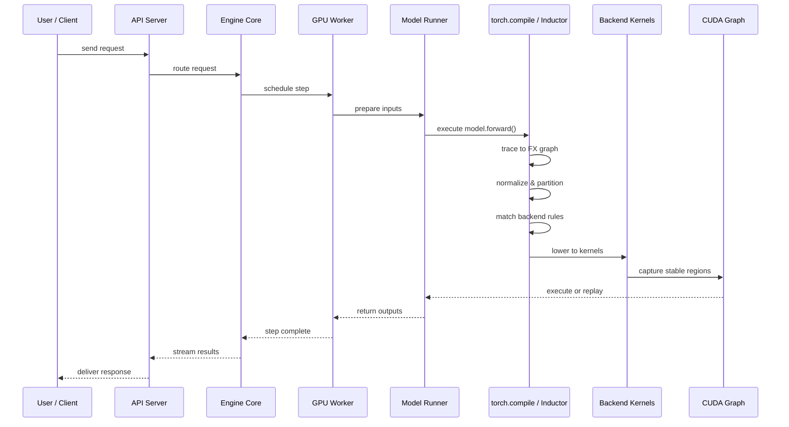
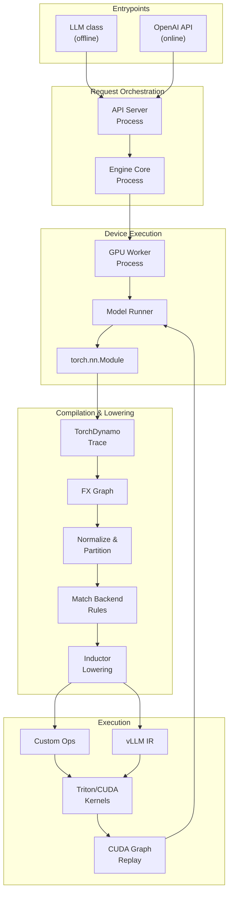
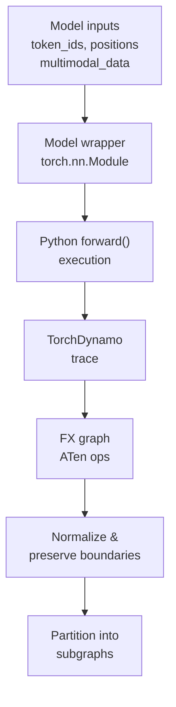
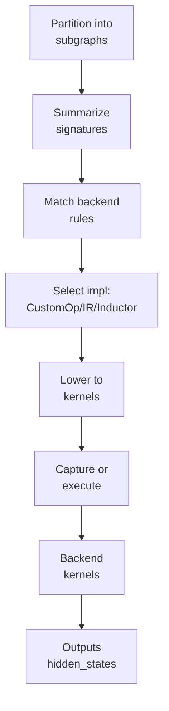

# End-to-End Architecture

This document traces the complete path from model loading through backend operator dispatch and execution.

## System overview

## Layered architecture

## Data flow: model to kernels

## Ownership and responsibility

| Layer | Owner | Responsibility |
| --- | --- | --- |
| **Entrypoint** | LLM class / API server | Accept requests, manage lifecycle |
| **Orchestration** | Engine core | Schedule work, coordinate execution |
| **Device execution** | Worker + model runner | Load model, prepare inputs, manage state |
| **Model wrapper** | Model registry | Select correct Python model class |
| **Trace capture** | TorchDynamo | Convert Python forward to FX graph |
| **Graph normalization** | vLLM passes | Preserve boundaries, functionalize |
| **Partitioning** | vLLM + Inductor scheduler | Split into reusable regions |
| **Signature matching** | vLLM backend matcher | Summarize operator and tensor metadata |
| **Backend selection** | CustomOp / vLLM IR / registries | Choose implementation by priority |
| **Lowering** | Inductor | Generate kernel code |
| **Replay** | CUDA graph manager | Capture and reuse stable regions |
| **Execution** | GPU worker | Run kernels or replay graphs |

## Key decision points

### 1. Model adaptation boundary

**Question**: Which Python model class should we use?

**Answer**: Model registry looks up the architecture name and selects the correct wrapper.

**Owner**: Hugging Face integration + model registry

**Example**: `Qwen/Qwen2-7B` → `Qwen2ForCausalLM` class

### 2. Compilation boundary

**Question**: Which regions can be compiled together?

**Answer**: TorchDynamo traces executable regions; custom ops and graph breaks define boundaries.

**Owner**: TorchDynamo + custom-op registration

**Example**: Attention is wrapped as a custom op so Dynamo doesn't inspect its internals.

### 3. Backend selection boundary

**Question**: Which kernel should execute this subgraph?

**Answer**: Match operator structure and tensor metadata against registered implementations.

**Owner**: CustomOp / vLLM IR / backend registries

**Example**: If the region contains `rms_norm` + `matmul`, check if a fused kernel is available.

### 4. Replay boundary

**Question**: Can this region be captured as a CUDA graph?

**Answer**: Yes, if shapes are stable and memory behavior is predictable.

**Owner**: CUDA graph manager

**Example**: Decode-phase regions are usually replayable; prefill regions may not be.

## Patterns and design principles

| Pattern | Where | Why |
| --- | --- | --- |
| **Adapter** | Model registry, Hugging Face integration | Normalize many model families to one runtime interface |
| **Pipeline** | Trace → normalize → partition → match → lower → replay | Separate compiler stages cleanly |
| **Strategy** | Backend implementation priority lists | Choose best implementation for platform and shape |
| **Registry** | CustomOp and vLLM IR registries | Extend without changing orchestrator |
| **Facade** | Engine and runner APIs | Hide distributed execution and compilation details |

## Related docs

- [Architecture overview](overview.md)
- [Boundaries and contexts](boundaries.md)
- [Process model](process-model.md)
- [Execution pipeline](execution-pipeline.md)
- [Patterns](patterns.md)
- [Backend operator mapping](../backend_operator_mapping.md)
- [torch.compile integration](../torch_compile.md)
- [CustomOp](../custom_op.md)
- [vLLM IR](../vllm_ir.md)
