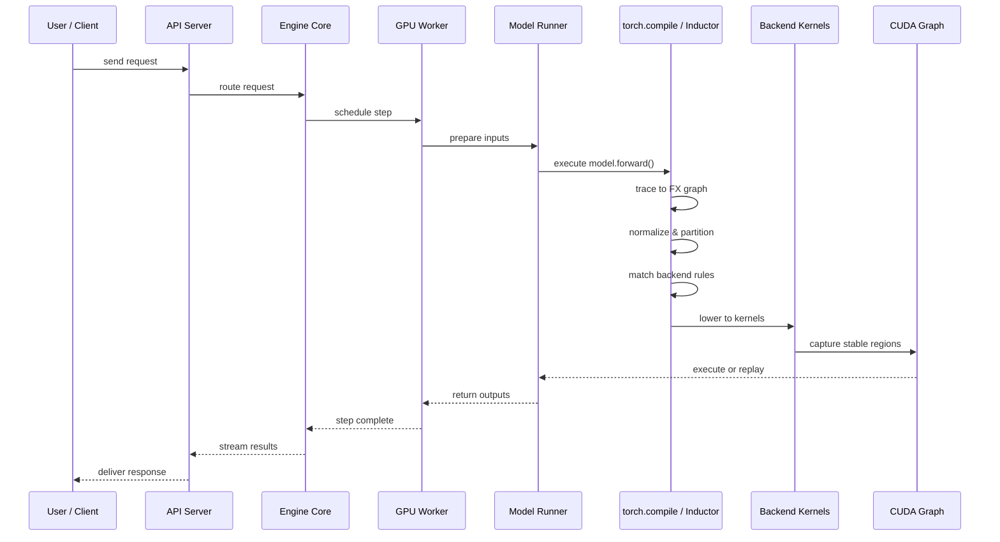
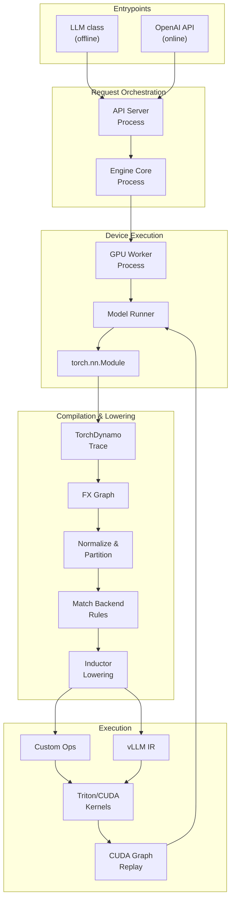
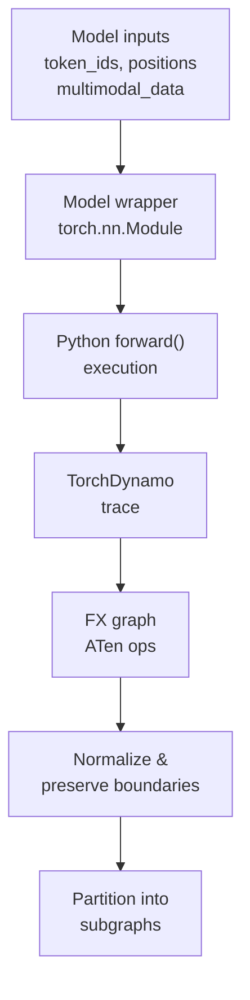
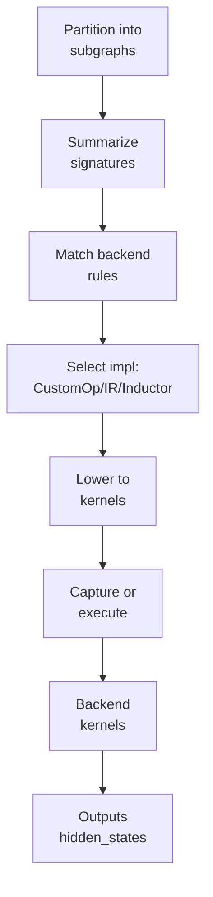
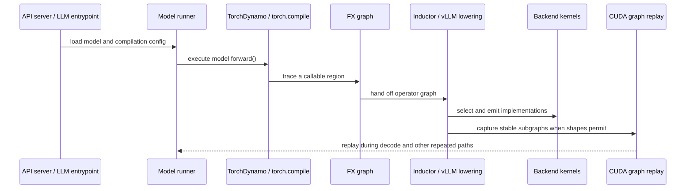
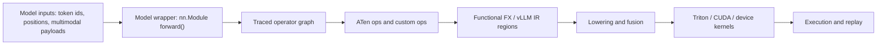

# End-to-End Architecture

This document traces the complete path from model loading through backend operator dispatch and execution.

## System overview



## Layered architecture



## Data flow: model to kernels




## Ownership and responsibility

| Layer | Owner | Responsibility |
| --- | --- | --- |
| **Entrypoint** | LLM class / API server | Accept requests, manage lifecycle |
| **Orchestration** | Engine core | Schedule work, coordinate execution |
| **Device execution** | Worker + model runner | Load model, prepare inputs, manage state |
| **Model wrapper** | Model registry | Select correct Python model class |
| **Trace capture** | TorchDynamo | Convert Python forward to FX graph |
| **Graph normalization** | vLLM passes | Preserve boundaries, functionalize |
| **Partitioning** | vLLM + Inductor scheduler | Split into reusable regions |
| **Signature matching** | vLLM backend matcher | Summarize operator and tensor metadata |
| **Backend selection** | CustomOp / vLLM IR / registries | Choose implementation by priority |
| **Lowering** | Inductor | Generate kernel code |
| **Replay** | CUDA graph manager | Capture and reuse stable regions |
| **Execution** | GPU worker | Run kernels or replay graphs |

## Key decision points

### 1. Model adaptation boundary

**Question**: Which Python model class should we use?

**Answer**: Model registry looks up the architecture name and selects the correct wrapper.

**Owner**: Hugging Face integration + model registry

**Example**: `Qwen/Qwen2-7B` → `Qwen2ForCausalLM` class

### 2. Compilation boundary

**Question**: Which regions can be compiled together?

**Answer**: TorchDynamo traces executable regions; custom ops and graph breaks define boundaries.

**Owner**: TorchDynamo + custom-op registration

**Example**: Attention is wrapped as a custom op so Dynamo doesn't inspect its internals.

### 3. Backend selection boundary

**Question**: Which kernel should execute this subgraph?

**Answer**: Match operator structure and tensor metadata against registered implementations.

**Owner**: CustomOp / vLLM IR / backend registries

**Example**: If the region contains `rms_norm` + `matmul`, check if a fused kernel is available.

### 4. Replay boundary

**Question**: Can this region be captured as a CUDA graph?

**Answer**: Yes, if shapes are stable and memory behavior is predictable.

**Owner**: CUDA graph manager

**Example**: Decode-phase regions are usually replayable; prefill regions may not be.

## Patterns and design principles

| Pattern | Where | Why |
| --- | --- | --- |
| **Adapter** | Model registry, Hugging Face integration | Normalize many model families to one runtime interface |
| **Pipeline** | Trace → normalize → partition → match → lower → replay | Separate compiler stages cleanly |
| **Strategy** | Backend implementation priority lists | Choose best implementation for platform and shape |
| **Registry** | CustomOp and vLLM IR registries | Extend without changing orchestrator |
| **Facade** | Engine and runner APIs | Hide distributed execution and compilation details |

## Related docs

- [Architecture overview](overview.md)
- [Boundaries and contexts](boundaries.md)
- [Process model](process-model.md)
- [Execution pipeline](execution-pipeline.md)
- [Patterns](patterns.md)
- [Backend operator mapping](../backend_operator_mapping.md)
- [torch.compile integration](../torch_compile.md)
- [CustomOp](../custom_op.md)
- [vLLM IR](../vllm_ir.md)


# Backend Operator Mapping

This document describes how vLLM maps model execution into optimized backend subgraphs. It focuses on the runtime view used by `torch.compile`, custom ops, Inductor lowering, and piecewise CUDA graph capture.

## Scope

vLLM does not rely on layer names alone to choose backend kernels. The backend mapping is driven by traced operator structure, tensor metadata, registered custom ops, and the execution constraints of the target platform.

Model-family awareness still exists, but it lives at the model-adaptation boundary, where vLLM selects the appropriate Python model wrapper and metadata builder. The mapping described here starts after that boundary, when the model's `forward()` method begins executing.

## Multi-view architecture

### 1. Context view

| Component | Responsibility | Mapping role |
| --- | --- | --- |
| Model registry | Selects the Python model implementation for a supported architecture | Establishes the high-level model wrapper |
| Model runner | Owns the loaded `torch.nn.Module` and executes forward passes | Provides the execution entrypoint |
| TorchDynamo / `torch.compile` | Captures executable regions from Python forward code | Produces the FX graph |
| Custom ops | Encapsulate hotspots with explicit dispatch boundaries | Preserve stable graph boundaries for specialization |
| vLLM IR | Represents high-level operations with late kernel selection | Keeps semantics separate from implementation |
| Inductor | Lowers traced graph regions into executable kernels | Performs fusion and code generation |
| CUDA graph capture | Replays stable execution segments | Reduces launch overhead for repeated shapes |

### 2. Control-flow view



### 3. Data-flow view



### 4. Decision view

| Condition | Backend choice | Reason |
| --- | --- | --- |
| Stable, repeated region with compatible shapes | CUDA graph replay | Minimizes launch overhead |
| Operator sequence matches a registered custom op | Custom op backend | Preserves a high-value boundary with explicit dispatch |
| High-level vLLM IR op is present | IR lowering chooses implementation by priority | Keeps semantics and implementation separate |
| General ATen region without a special boundary | Inductor fusion and lowering | Produces generic optimized kernels |
| Unsupported or graph-breaking code appears | Eager fallback for that region | Preserves correctness |

### 5. Backend mapping contract

The mapping layer treats the model as a sequence of executable regions, not as a set of semantic layer names. It uses the following contract:

- **Inputs** are tensors and model state, not ONNX nodes or exported layer annotations.
- **Compilation units** are traced regions captured from `forward()`.
- **Optimization signals** come from operator kinds, tensor shapes, dtypes, layouts, and explicit custom-op boundaries.
- **Kernel selection** happens late, after the graph is already in a compiler-friendly form.
- **Replay** applies only where the runtime sees a stable region with compatible shapes and memory behavior.

### 6. What the mapping does not assume

- It does not require a fixed layer name such as Llama or Qwen to identify a backend kernel.
- It does not require ONNX as the primary serving artifact.
- It does not assume that the whole model is frozen into one static graph.
- It does not assume that every Python line is compiled; graph breaks still create eager regions.

## Appendix A — Discussion clarifications

The discussion that motivated this document established the following clarifications, which this design uses as its terminology:

- **ATen ops** are the operator-level units that `torch.compile` and Inductor see inside a traced region.
- **FX graphs** are produced from the model's `forward()` path by TorchDynamo as part of `torch.compile`.
- **Static graph** in vLLM refers to a reusable compiled subgraph or CUDA graph capture, not a whole-model frozen export.
- **ONNX** is not the main input representation for vLLM serving.
- **Model-layer names** are used for model adaptation and wrapper selection, but backend optimization is driven by operator structure and execution metadata.
- **Custom ops** are the mechanism vLLM uses when it wants to preserve a stable boundary around a hotspot such as attention, Mamba-like layers, or fused MLP paths.
- **Piecewise compilation** means the runtime keeps attention-like regions separate while compiling or capturing the surrounding regions for reuse.

## Appendix B — Pattern matching and subgraph identification

This section describes the runtime matching path in a form that is closer to the compiler and backend implementation than to the model semantics.

### What gets matched

The matcher operates on:

- operator kind and ordering
- tensor shape, dtype, and layout metadata
- explicit custom-op boundaries
- stable regions that can be reused across repeated steps
- compiler-side partition boundaries such as attention-like cuts

The matcher does **not** require:

- semantic layer names such as Llama or Qwen
- ONNX export as the serving input format
- a whole-model static graph
- perfect compilation coverage for every Python branch

### Matching flow

```mermaid
flowchart LR
    A["Model forward()\nOwner: model wrapper / torch.nn.Module"] --> B["TorchDynamo trace\nOwner: torch._dynamo / torch.compile"]
    B --> C["FX graph\nOwner: TorchDynamo graph capture"]
    C --> D["Normalize functional ops and preserve custom-op boundaries\nOwner: vLLM compilation passes + CustomOp"]
    D --> E["Split into candidate subgraphs\nOwner: vLLM partitioning + Inductor scheduler"]
    E --> F["Summarize each subgraph: ops, shapes, dtypes, layouts\nOwner: vLLM backend matcher"]
    F --> G["Match against backend rules and priority lists\nOwner: vLLM IR lowering / registry"]
    G --> H["Select implementation or fallback path\nOwner: CustomOp dispatch / vLLM IR"]
    H --> I["Lower to kernels or capture CUDA graph\nOwner: Inductor + cudagraph manager"]
    I --> J["Execute or replay\nOwner: model runner / GPU worker"]
```



### Step ownership summary

| Step | Owner module | Role |
| --- | --- | --- |
| Trace `forward()` | TorchDynamo / `torch.compile` | Captures executable Python regions |
| Build FX graph | TorchDynamo | Produces the compiler-facing graph |
| Preserve boundaries | vLLM compilation passes, `CustomOp` | Keeps attention-like and fused hotspots visible |
| Split subgraphs | vLLM partitioning, Inductor scheduler | Cuts the graph into reusable regions |
| Summarize regions | vLLM backend matcher | Collects operator and tensor signatures |
| Match rules | vLLM IR lowering / registries | Chooses the best implementation for the region |
| Lower or capture | Inductor, cudagraph manager | Emits kernels or replayable graphs |
| Execute | Model runner / GPU worker | Runs the selected backend path |

### Pseudocode

```text
trace = Dynamo.capture(model.forward)
segments = split(trace, boundaries = custom_ops + splitting_ops + graph_breaks)

for segment in segments:
    signature = summarize(
        ops = segment.operators,
        shapes = segment.tensor_shapes,
        dtypes = segment.tensor_dtypes,
        layouts = segment.tensor_layouts,
    )

    if segment.contains_high_level_ir:
        impl = select_by_priority(signature, ir_priority_list)
    elif segment.is_cuda_graph_eligible and segment.is_stable:
        impl = capture_cuda_graph(segment)
    else:
        impl = lower_with_inductor(segment)

    run(impl)
```

### DDD and design-pattern view

vLLM is not a pure domain-driven design system, but it does exhibit bounded-context-like seams:

| Bounded context | Responsibility | Notes |
| --- | --- | --- |
| Model adaptation | Resolve model family, config, and wrapper selection | This is where architecture names matter |
| Execution planning | Capture, split, and classify executable regions | This is where subgraph recognition happens |
| Kernel execution | Dispatch kernels, custom ops, and backend implementations | This is where Strategy and Registry patterns dominate |
| Request orchestration | Schedule work, manage batches, and coordinate workers | This is the control plane |

The main design patterns are:

| Pattern | Where it appears | Why it fits |
| --- | --- | --- |
| Adapter | Hugging Face integration and model registry | Normalizes many model families to a uniform runner interface |
| Pipeline | Trace → normalize → split → match → lower → replay | Separates compiler stages cleanly |
| Strategy | Backend implementation priority lists | Chooses the best implementation for the current platform and shape |
| Registry | CustomOp and vLLM IR implementation registries | Supports open-ended extension without changing the matcher |
| Facade | Model runner and engine APIs | Hide distributed execution and compilation details from callers |

### Original source references

| Claim | Original file | Line range |
| --- | --- | --- |
| Dynamo traces `forward()` and the traced file set becomes part of the cache key | `docs/design/torch_compile.md` | `162-164` |
| Attention is wrapped as a custom op so Dynamo does not inspect its internals | `docs/design/torch_compile.md` | `172-179` |
| Piecewise CUDA graph capture follows the split graph structure | `docs/design/torch_compile.md` | `241-256` |
| `CustomOp` dispatches by platform and can be enabled or disabled by config | `docs/design/custom_op.md` | `10-35` |
| vLLM IR is a torch FX dialect with late kernel selection and priority-based implementation choice | `docs/design/vllm_ir.md` | `4-30`, `191-259` |
| Inductor partitioning is patched around custom partition and splitting ops | `vllm/env_override.py` | `335-409` |
| Model family selection happens before backend optimization at the Hugging Face boundary | `docs/design/huggingface_integration.md` | `6-20` |
